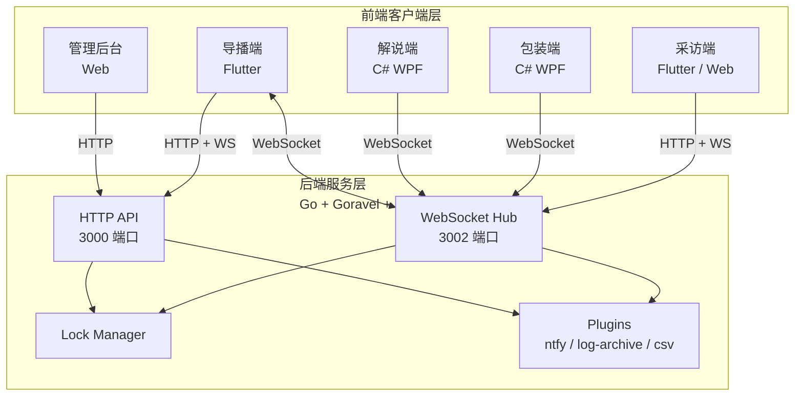
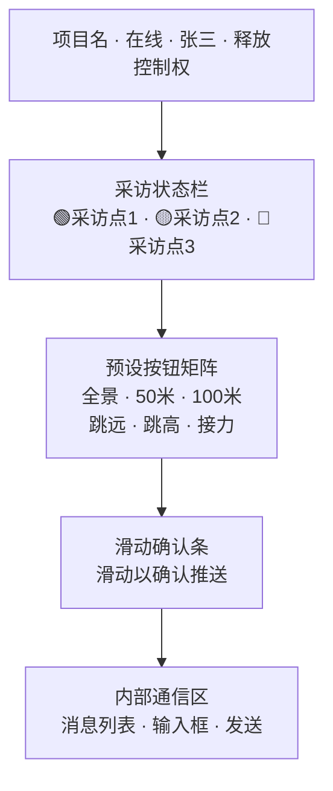
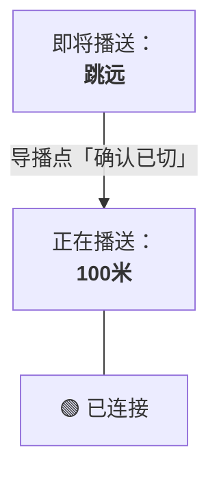
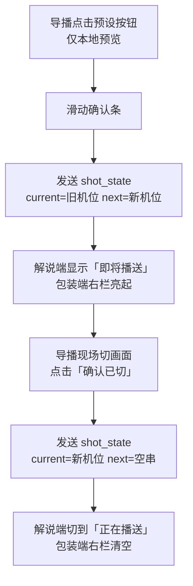

# 校园直播导播协调系统 —— 操作手册

---

## 系统概述

本系统用于校园直播活动中，解决导播切画面与解说不同步的痛点，实现**导播预判指令 → 解说提前准备 → 包装同步联动 → 采访状态透明**的全链路协同。

::: tip 推荐阅读顺序
首次部署建议依次阅读「安装与部署」「配置说明」和「系统初始化」，完成基础配置后再阅读各端操作指南。
:::

### 系统架构



### 端口分配

| 端口 | 服务 | 说明 |
|------|------|------|
| 3000 | HTTP API | 管理后台、REST API、认证 |
| 3002 | WebSocket | 实时通讯、采访端 Web 托管 |

### 访问地址

| 页面 | 地址 |
|------|------|
| 系统首页 | `http://<服务器IP>:3000/` |
| 管理后台 | `http://<服务器IP>:3000/admin` |
| 采访端 Web | `http://<服务器IP>:3002/interviewer/` |
| API 状态 | `http://<服务器IP>:3000/api/status` |

---

## 安装与部署

### 环境要求

- **后端**：Go 1.25+、SQLite（内嵌，无需安装）
- **导播端**：Flutter SDK、Android SDK / Windows SDK
- **解说端/包装端**：.NET 10 Runtime
- **采访端**：Flutter SDK（Web 部署）或现代浏览器（Web 访问）

### 后端部署

#### 方式一：直接运行（推荐开发环境）

```bash
cd backend

# 1. 配置环境变量
cp .env.example .env
# 编辑 .env 文件，配置以下关键项：
# APP_PORT=3000
# JWT_SECRET=<随机生成的32位字符串>
# DB_CONNECTION=sqlite

# 2. 安装依赖
go mod tidy

# 3. 构建并运行
go build -o smart-mzcmc.exe .
./smart-mzcmc.exe
```

#### 方式二：Docker 部署

```bash
cd backend

# 构建镜像
docker build -t smart-mzcmc .

# 运行容器
docker run -d \
  -p 3000:3000 \
  -p 3002:3002 \
  -v $(pwd)/database:/www/database \
  -v $(pwd)/.env:/www/.env \
  --name smart-mzcmc \
  smart-mzcmc
```

#### 方式三：使用 Air 热重载（推荐开发）

```bash
cd backend
air
```

### 导播端编译

```bash
cd director

# 获取依赖
flutter pub get

# Windows 桌面端
flutter build windows

# Android APK
flutter build apk

# Web 版本
flutter build web
```

### 采访端编译

```bash
cd interviewer

# 获取依赖
flutter pub get

# Web 部署（推荐）
flutter build web

# 产物位置：interviewer/build/web/
# 后端启动时按 public/interviewer -> interviewer/build/web 的顺序查找，
# 所以本地构建后直接重启后端即可；若要模拟线上发布包布局，再执行：
cp -r build/web/* ../backend/public/interviewer/
```

### 解说端/包装端编译

```bash
cd CommentatorApp   # 或 PackagingApp

# 获取依赖
dotnet restore

# 编译
dotnet build -c Release

# 发布（单文件）
dotnet publish -c Release -r win-x64 --self-contained
```

---

## 配置说明

### 后端配置文件 `.env`

::: warning 安全提示
`JWT_SECRET` 必须使用随机字符串，并且不要提交 `.env`、数据库文件或真实的 ntfy 配置。生产环境请关闭调试模式并限制管理端访问范围。
:::

```dotenv
# 应用基础配置
APP_NAME=SmartMZCMC
APP_ENV=local
APP_DEBUG=true
APP_PORT=3000
APP_HOST=0.0.0.0

# JWT 认证（必须配置）
JWT_SECRET=your-random-32-char-secret-key-here

# 数据库（默认 SQLite）
DB_CONNECTION=sqlite
DB_DATABASE=database/smart-mzcmc.db

# 插件配置（可选，详见后文）
# ntfy 告警：两项都填才会启用；只填一项会被停用并在后台标出原因
NTFY_SERVER=https://ntfy.sh
NTFY_TOPIC=your-alert-topic
# PLUGIN_NTFY_ENABLED=false   # 配置齐全但仍想关闭时用

# 日志归档
PLUGIN_LOG_ARCHIVE_ENABLED=true
PLUGIN_LOG_RETENTION_DAYS=30
PLUGIN_LOG_CHECK_INTERVAL=1h

# 日志导出接口
PLUGIN_CSV_EXPORT_ENABLED=true
```

改完 `.env` 重启后端，然后到管理后台「插件与统计」页确认：
每个插件卡片会显示**真实的启用状态**（已启用 / 已停用）、停用原因和生效配置。
ntfy topic 之类的机密值在界面上是脱敏显示的（形如 `su****yz`）。

若某个插件显示「已停用」，卡片上会直接写明原因，不用去翻服务端日志。

| 环境变量 | 默认值 | 说明 |
|--------|--------|------|
| `NTFY_SERVER` | 空 | ntfy 服务器地址 |
| `NTFY_TOPIC` | 空 | ntfy 主题名 |
| `PLUGIN_NTFY_ENABLED` | 空 | 显式开关；留空按前两项是否配齐自动判断 |
| `PLUGIN_LOG_ARCHIVE_ENABLED` | `true` | 是否启用日志自动清理 |
| `PLUGIN_LOG_RETENTION_DAYS` | `30` | 日志保留天数 |
| `PLUGIN_LOG_CHECK_INTERVAL` | `1h` | 清理检查间隔，支持 `30s` / `5m` / `1h` |
| `PLUGIN_CSV_EXPORT_ENABLED` | `true` | 是否启用日志导出接口 |

::: tip 升级到新版本后
如果从旧版本升级，执行一次 `go run . migrate`（或 `smart-mzcmc.exe migrate`），
它会清掉历史心跳消息——旧版本把每个客户端每 10 秒一条心跳都写进了日志表，
导致日志审计页和消息统计几乎全是噪音。该操作只删除心跳，不可逆。
:::

### 各端地址配置

正式环境走反向代理，所有客户端只需填**一个域名**，不用再带端口：

| 端 | 配置文件 | 是否需要重新编译 |
| :--- | :--- | :--- |
| 管理后台 | 无需配置（默认同源） | 否 |
| 解说端 | exe 同目录 `config.json` | **否**，改完重启 exe |
| 包装端 | exe 同目录 `config.json` | **否**，改完重启 exe |
| 采访端 | `public/interviewer/config.json` | **否**，刷新浏览器 |
| 导播端 | `director/lib/config.dart` | **是**，改完 `flutter build` |

#### 解说端 / 包装端

编辑与 exe 同目录的 `config.json`：

```json
{
  "ServerUrl": "http://zhdb.647382.xyz",
  "WsUrl": "ws://zhdb.647382.xyz/ws",
  "ProjectId": 1,
  "Role": "commentator"
}
```

> **Role 可选值**：`commentator`（解说端）、`packaging`（包装端）
>
> `ServerUrl` 当前**没有任何代码使用**——两个桌面端只通过 WebSocket 通信，
> 不发 HTTP 请求。留着只是为了以后可能用到，不影响。

#### 采访端

编辑 `backend/public/interviewer/config.json`，刷新浏览器即可：

```json
{
  "wsUrl": "ws://zhdb.647382.xyz/ws",
  "projectId": 1,
  "pointCode": "point_1",
  "pointName": "采访点 1"
}
```

这是**运行期**配置：采访端是 Web 产物，浏览器启动时会读这个文件覆盖内置默认值。
好处是现场换服务器地址不用重新构建、重新部署整个采访端。

`pointCode` 决定这台设备在管理后台里对应哪个采访点。同一项目下多台设备各配一个不同的 `pointCode`。
`config.json` 写坏了也不会让采访端起不来——取不到或字段不合法时会回落到内置默认值。

#### 导播端

编辑 `director/lib/config.dart` 后**必须重新编译**：

```dart
class AppConfig {
  static const String serverUrl = 'http://zhdb.647382.xyz';
  static const String wsUrl = 'ws://zhdb.647382.xyz/ws';
}
```

```sh
cd director && flutter build windows --release
```

导播端是装在导播室机器上的原生应用，不像采访端那样有可改的外部配置文件。

---

::: danger 启用 HTTPS 后必须把所有 ws:// 换成 wss://
浏览器把 https 页面里的 `ws://` 判为**混合内容**直接拦掉，
连不上而且**不报任何错**——表现就是各端状态灯一直转圈。

需要改的三处：
1. 解说端 / 包装端的 `config.json`
2. `public/interviewer/config.json`
3. `director/lib/config.dart`（并重新编译）

`serverUrl` 同理要改成 `https://`。
:::

### 反向代理部署

后端本身监听两个端口：`3000`（API、首页、后台、文档站）和 `3002`（WebSocket、采访端）。
生产环境在前面放一层 nginx，把两者收拢到同一个域名：

```nginx
# 必须在 http {} 块里（宝塔的 vhost 文件就是在 http 块内 include 的）
map $http_upgrade $smartmzcmc_connection_upgrade {
    default upgrade;
    ''      close;
}

server {
    # 3002：WebSocket
    location ^~ /ws {
        proxy_pass http://127.0.0.1:3002;
        proxy_http_version 1.1;
        proxy_set_header Upgrade    $http_upgrade;
        proxy_set_header Connection $smartmzcmc_connection_upgrade;
        proxy_set_header Host              $host;
        proxy_set_header X-Forwarded-For   $proxy_add_x_forwarded_for;
        proxy_set_header X-Forwarded-Proto $scheme;
        proxy_read_timeout 300s;
        proxy_buffering off;
    }

    # 3002：采访端
    location ^~ /interviewer/ {
        proxy_pass http://127.0.0.1:3002;
        proxy_set_header Host $host;
    }

    # 3000：其余全部
    location / {
        proxy_pass http://127.0.0.1:3000;
        proxy_set_header Host              $host;
        proxy_set_header X-Forwarded-For   $proxy_add_x_forwarded_for;
        proxy_set_header X-Forwarded-Proto $scheme;
    }
}
```

几个必须注意的点：

| 事项 | 原因 |
| :--- | :--- |
| 用 `location ^~ /ws` 而不是 `= /ws` | 首页还会请求 `/ws/status` 拿在线连接数 |
| **不能**写成 `/ws/` | 后端 Go `ServeMux` 把 `/ws` 注册为精确匹配，带斜杠匹配不上 |
| `proxy_read_timeout` 至少 300s | 默认 60s。笔记本休眠时心跳会停，60s 断线会让服务端释放导播控制权 |
| `Connection` 用 map 而不是写死 `"upgrade"` | 写死会让普通 GET 也带 `Connection: upgrade`，破坏上游 keepalive |
| 删掉宝塔的 `rewrite/go_*.conf` | 那是 Go 框架伪静态模板，会重写查询串，而本项目全靠查询串传参 |
| 3002 只监听 127.0.0.1 | 无需对外开放，公网只暴露 80/443 |

验证：

```bash
curl -I http://zhdb.647382.xyz/                            # 200
curl    http://zhdb.647382.xyz/ws/status                   # {"status":"ok",...}
curl -I http://zhdb.647382.xyz/interviewer/                # 200
curl -I http://zhdb.647382.xyz/interviewer/config.json     # 200
```

`curl` 测不出 WebSocket（不发 Upgrade 头），直接看系统首页右上角的连接状态最快。

---

## 系统初始化

### 创建管理员账号

系统没有预置账号。**用户表为空时，第一个注册的人自动成为管理员**，
不需要任何登录态，也不需要额外密钥——这是全新部署拿到管理员的唯一途径。

推荐在服务器上直接执行：

```bash
curl -X POST http://localhost:3000/api/auth/register \
  -H "Content-Type: application/json" \
  -d '{
    "username": "admin",
    "password": "admin123456",
    "display_name": "系统管理员"
  }'
```

成功返回 `201`：

```json
{"id":1,"username":"admin","display_name":"系统管理员","role":"admin"}
```

几个要点：

| 事项 | 说明 |
| :--- | :--- |
| `role` 不用传 | 引导模式下该字段会被忽略，第一个账号固定是 `admin` |
| 密码至少 6 位 | 低于 6 位返回 400 `密码至少 6 位` |
| 用户名限 64 字符内 | 只能包含字母、数字、`_`、`.`、`-` 与中文 |
| **只有一次机会** | 第一个账号建好后，该接口立刻切换为「仅管理员可调用」 |

::: danger 务必在开放端口前完成这一步
`POST /api/auth/register` 是公开路由。在用户表为空之前，**任何能访问到
3000 端口的人**都可以抢先注册管理员。做完这一步后接口会自动收紧，
但在那之前请不要把端口暴露到公网。
:::

上机验证：

```bash
curl -X POST http://localhost:3000/api/auth/register \
  -H "Content-Type: application/json" \
  -d '{"username":"hacker","password":"hacker123","role":"admin"}'
# 期望：401 {"error":"系统已有账号，创建用户需要管理员登录"}
```

### 登录管理后台

1. 访问 `http://<服务器IP>:3000/admin`
2. 输入刚创建的用户名与密码
3. 登录成功后进入管理后台

令牌有效期 60 分钟，过期后前端会自动跳回登录页（后端返回 401 + 可读错误消息）。

### 创建项目

1. 在管理后台点击「项目管理」标签
2. 点击「+ 新建项目」
3. 填写项目名称（如：校园运动会）、编码（如：sports2025）、描述
4. 点击「创建」

### 创建导播账号

1. 在管理后台点击「用户管理」标签
2. 点击「+ 新建用户」
3. 填写用户名（≤64 字符）、密码（**至少 6 位**）、显示名
4. 角色选择「导播」
5. 点击「创建」

::: tip 创建用户需要管理员登录态
`新建用户` 走的是同一个 `POST /api/auth/register`，但只有在管理员登录后
才能调用。导播账号即使自己调这个接口也会收到 403。
:::

### 分配项目权限

1. 在管理后台点击「权限分配」标签
2. 选择用户和项目
3. 点击「分配」

---

## 各端操作指南

### 导播端（Flutter 手机/平板）

#### 登录

1. 启动导播端应用
2. 输入服务器地址、用户名、密码
3. 点击「登录」

#### 主界面说明



#### 操作流程

1. **获取控制权**：点击右上角「获取控制权」按钮
2. **选择项目**：从下拉框选择当前直播项目
3. **发送切台指令**（每次切台分两步，后端各收到一条 `shot_state`）：
   - 点击预设按钮（如「50米」），状态条显示「即将切台 50米」
   - **滑动底部确认条** → 下发「即将切台」，解说端变红，包装端右栏亮起
   - 现场把画面切过去后，点击 **「确认已切」** → 下发「正在播送」，
     解说端变绿，包装端右栏清空
4. **发送内部消息**：在底部输入框输入消息，点击「发送」
5. **释放控制权**：点击右上角「释放控制权」按钮

> **注意**：同一项目同一时间只有一名导播能持有控制权。导播断线时控制权自动释放。

### 解说端（C# 桌面应用）

#### 启动

1. 双击 `CommentatorApp.exe`
2. 应用自动读取 `config.json` 配置并连接服务器
3. 右下角绿点表示已连接

#### 界面说明

窗口只有一块主显示区，按后端指令在两种状态间切换：



#### 状态说明

| 状态 | 显示 |
|------|------|
| 收到 `shot_state`，`next` 非空 | 「即将播送：」+ 机位名，**琥珀红**，背景转为暗红 |
| 收到 `shot_state`，`next` 为空 | 「正在播送：」+ 机位名，**绿色**，背景为深蓝 |
| 收到新的 `shot_state` | 整体替换为新状态，不需要等待 |
| 断线重连 | 右下角红点，自动重连（指数退避） |

> 解说端不再自行推断「正在播送」，也不再有 5 秒自动清空计时器——
> 状态完全由后端下发的 `shot_state` 决定。

### 包装端（C# 桌面应用）

#### 启动

1. 双击 `PackagingApp.exe`
2. 应用自动读取 `config.json` 配置并连接服务器

#### 功能

- 同时显示「正在播送」与「即将切台」两栏，由后端 `shot_state` 驱动
- 接收导播发送的内部消息
- 显示消息历史记录

### 采访端（Flutter/Web）

#### 方式一：Web 访问（推荐）

1. 浏览器访问 `http://<服务器IP>:3002/interviewer/`
2. 页面显示巨大状态按钮

#### 方式二：Flutter App

1. 启动应用，修改 `config.dart` 中的服务器地址和采访点配置
2. 编译运行

#### 操作

- **点击巨大按钮**切换状态：
  - 灰色（未就绪）→ 蓝色（准备中）→ 绿色（就绪）→ 循环
- 状态变更实时推送给导播端和包装端
- 底部显示 WebSocket 连接状态

---

## API 接口参考

### 认证接口

| 方法 | 路径 | 说明 | 认证 |
|------|------|------|------|
| POST | `/api/auth/login` | 登录 | 否 |
| POST | `/api/auth/register` | 创建用户（见下方双模式说明） | 视状态而定 |
| GET | `/api/auth/profile` | 获取当前用户信息 | JWT |

**登录请求示例：**

```json
POST /api/auth/login
{
  "username": "admin",
  "password": "admin123456"
}
```

::: warning `POST /api/auth/register` 的双模式
这是唯一一个「有时公开、有时需要管理员」的接口，行为取决于数据库当前状态：

| 系统状态 | 需要认证 | `role` 字段 | 用途 |
| :--- | :--- | :--- | :--- |
| **用户表为空** | 否 | 被忽略，强制 `admin` | 全新部署创建第一个管理员 |
| **已有任何用户** | 是，且必须是 `admin` | 必须是 `admin` 或 `director` | 管理后台「新建用户」 |

其他角色的调用一律 403。另外：

- 密码至少 6 位，否则 400；
- 用户名 ≤64 字符，仅限字母、数字、`_`、`.`、`-` 与中文，否则 400；
- 用户名重复返回 409。

对应状态码：401 未登录/令牌无效、403 角色不足、400 参数不合法、409 用户名已存在。
:::

**响应：**

```json
{
  "token": "eyJhbGciOiJIUzI1NiIs...",
  "user": {
    "id": 1,
    "username": "admin",
    "display_name": "系统管理员",
    "role": "admin"
  }
}
```

### 管理接口（需 JWT + admin 角色）

| 方法 | 路径 | 说明 |
|------|------|------|
| GET | `/api/admin/users` | 用户列表 |
| DELETE | `/api/admin/users/:id` | 删除用户 |
| PUT | `/api/admin/users/:id/role` | 更新用户角色 |
| GET | `/api/admin/projects` | 项目列表 |
| POST | `/api/admin/projects` | 创建项目 |
| PUT | `/api/admin/projects/:id` | 更新项目 |
| DELETE | `/api/admin/projects/:id` | 删除项目 |
| POST | `/api/admin/assign` | 分配用户到项目 |
| POST | `/api/admin/revoke` | 撤销项目授权 |
| GET | `/api/admin/users/:id/projects` | 查询用户项目 |

::: danger 只校验「令牌有效」是不够的
JWT 中间件只判断令牌能不能被解开，不关心持有者是谁。所以这组接口额外挂了
`RequireRole("admin")`：每次请求都查库比对角色，**不信任令牌里缓存的角色**。

这样管理员在后台把某个人的角色降下来，那个人手里的旧令牌会**立即失效**，
而不是等到 60 分钟自然过期。导播角色调用这组接口会收到 403。
:::

同理，`/api/logs/export`、`/api/logs/export/csv`、`/api/logs/cleanup`
这三个会改动数据的接口也仅管理员可用；只读的 `/api/logs`、
`/api/plugins`、`/api/messages/:projectId` 保持「已登录即可」，
因为导播端与管理后台都要读它们。

### 控制权接口（需 JWT 认证）

| 方法 | 路径 | 说明 |
|------|------|------|
| POST | `/api/locks/:projectId/acquire` | 获取控制权 |
| POST | `/api/locks/:projectId/release` | 释放控制权 |
| POST | `/api/locks/:projectId/heartbeat` | 心跳续期 |
| GET | `/api/locks/:projectId/status` | 查询锁状态 |

### 采访接口（无需认证）

| 方法 | 路径 | 说明 |
|------|------|------|
| GET | `/api/interview/:projectId` | 查询项目采访状态 |
| POST | `/api/interview/status` | 更新采访状态 |

### 日志接口（需 JWT 认证）

| 方法 | 路径 | 说明 |
|------|------|------|
| GET | `/api/messages/:projectId` | 查询项目消息 |
| GET | `/api/logs` | 查询日志 |
| POST | `/api/logs/export` | 导出日志（JSON） |
| POST | `/api/logs/export/csv` | 导出日志（CSV） |
| POST | `/api/logs/cleanup` | 清理旧日志 |

### WebSocket 连接

::: info 连接提示
导播端和管理员连接必须携带 JWT；解说端、包装端和采访端还需要使用正确的 `project_id` 与 `role`。连接地址使用 `3002` 端口，不是 HTTP API 的 `3000` 端口。
:::

```
ws://<服务器IP>:3002/ws?project_id=1&role=director&token=<JWT>
```

**连接参数：**

| 参数 | 必填 | 说明 |
|------|------|------|
| project_id | 是 | 项目 ID |
| role | 是 | 角色：director/commentator/packaging/interviewer |
| token | 导播/管理员必填 | JWT 令牌 |
| user_id | 否 | 用户 ID |
| point_code | 采访端必填 | 采访点编码 |

**消息格式：**

```json
{
  "type": "next_shot | confirm_switch | chat | interview_status | lock_update | system",
  "project_id": 1,
  "sender_id": 1,
  "payload": { ... },
  "timestamp": 1789000000000
}
```

---

## 核心机制说明

### 控制权互斥

- 同一项目同一时间只有一名导播持有控制权
- 导播上线时自动获取控制权（如果无人持有）
- 控制权有效期 90 秒，需定期心跳续期（30 秒间隔）
- 导播断线时自动释放控制权

### 状态流转

切台是「预告 → 确认」两步，每一步后端都会收到一条携带完整状态的 `shot_state`。



接收端不推断状态、不做本地计时，完全按后端下发的 `shot_state` 渲染。

### 断线重连

- 指数退避重连：1s → 2s → 4s → 最大 10s
- 后端维护消息缓冲区，重连后补发
- 状态型消息重连后只推最新状态

### 采访状态

| 状态 | 颜色 | 说明 |
|------|------|------|
| ready | 绿色 | 已就绪 |
| preparing | 蓝色 | 准备中 |
| not_ready | 灰色 | 未就绪 |
| offline | 红色 | 离线 |

---

## 故障排查

::: details 快速诊断顺序
先检查后端进程和 `3000/3002` 端口，再检查客户端服务器地址、项目 ID、角色和 JWT。最后查看后端控制台中的 `[AUTH]`、`[WS]` 日志。
:::

### 后端无法启动

| 问题 | 解决方案 |
|------|----------|
| 端口被占用 | 检查 3000/3002 端口：`netstat -ano | findstr :3000` |
| JWT_SECRET 未配置 | 在 `.env` 中设置 `JWT_SECRET` |
| 数据库权限问题 | 确保 `database/` 目录可写 |

### 客户端无法连接

| 问题 | 解决方案 |
|------|----------|
| WebSocket 连接失败 | 检查防火墙是否开放 3002 端口 |
| 认证失败 | 检查 JWT 是否过期，重新登录获取新 token |
| 控制权获取失败 | 检查是否已有其他导播持有控制权 |

### 解说端/包装端无法连接

| 问题 | 解决方案 |
|------|----------|
| 启动后无反应 | 检查 `config.json` 中的服务器地址和端口 |
| 连接后断开 | 检查网络稳定性，应用会自动重连 |
| WebSocket 地址错误 | 确认 `WsUrl` 指向 3002 端口 |

---

## 快速启动检查清单

- [ ] 后端 `.env` 已配置 `JWT_SECRET`
- [ ] 后端已启动（3000 + 3002 端口）
- [ ] 管理员账号已创建
- [ ] 项目已创建
- [ ] 导播账号已创建并分配项目权限
- [ ] 导播端已配置服务器地址并登录
- [ ] 解说端/包装端 `config.json` 已配置正确地址
- [ ] 采访端 `config.dart` 已配置服务器地址和采访点
- [ ] 所有客户端均已连接（检查连接状态指示器）

---

## 附录

### 项目目录结构

```
smart-mzcmc/
├── backend/              # Go 后端（Goravel 框架）
│   ├── app/              # 应用逻辑
│   │   ├── http/         # HTTP 控制器和中间件
│   │   ├── models/       # 数据模型
│   │   ├── plugins/      # 插件系统
│   │   └── ws/           # WebSocket 服务
│   ├── config/           # 配置文件
│   ├── database/         # SQLite 数据库
│   ├── public/           # 静态资源
│   │   ├── admin/        # 管理后台
│   │   └── interviewer/  # 采访端 Web 产物
│   ├── routes/           # 路由定义
│   └── .env              # 环境配置
├── director/             # 导播端 Flutter 项目
├── interviewer/          # 采访端 Flutter 项目
├── CommentatorApp/       # 解说端 C# 项目
├── PackagingApp/         # 包装端 C# 项目
├── plan.md               # 项目开发计划
└── start.bat             # 一键启动脚本（Windows）
```

### WebSocket 消息类型

| 类型 | 方向 | 说明 |
|------|------|------|
| shot_state | 导播 → 解说/包装 | 切台状态：`current` 当前播送 + `next` 即将切台（空串=已切完） |
| chat | 全部 | 内部消息；`{"message":"heartbeat"}` 为保活心跳，后端不落库不转发 |
| interview_status | 采访端 → 导播/包装 | 采访状态变更 |
| lock_update | 系统 → 全部 | 控制权变更通知 |
| system | 系统 → 客户端 | 系统消息（连接成功、权限错误等） |

> `next_shot` / `confirm_switch` 是协议升级前的旧类型，后端已合并进 `shot_state`，
> 收到时只回一条 `system` 错误并丢弃。

### 默认配置值

| 配置项 | 默认值 | 说明 |
|--------|--------|------|
| 控制权有效期 | 90 秒 | 导播控制权 TTL |
| 心跳间隔 | 30 秒 | 导播端心跳发送间隔 |
| WebSocket 超时 | 60 秒 | 读写超时 |
| 日志保留 | 30 天 | 自动清理旧日志 |
| 消息缓冲 | 50 条 | 重连后补发数量 |
