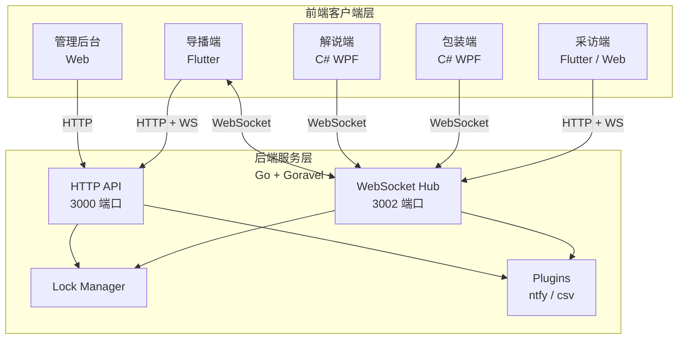
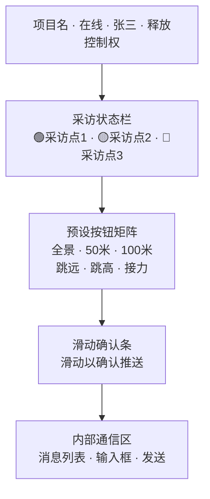
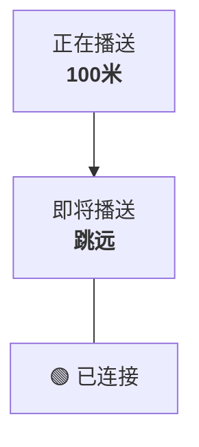
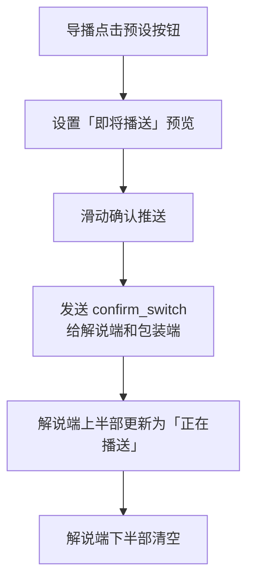

# 校园直播导播协调系统 —— 操作手册

---

## 系统概述

本系统用于校园直播活动中，解决导播切画面与解说不同步的痛点，实现**导播预判指令 → 解说提前准备 → 包装同步联动 → 采访状态透明**的全链路协同。

::: tip 推荐阅读顺序
首次部署建议依次阅读「安装与部署」「配置说明」和「系统初始化」，完成基础配置后再阅读各端操作指南。
:::

### 系统架构



### 端口分配

| 端口 | 服务 | 说明 |
|------|------|------|
| 3000 | HTTP API | 管理后台、REST API、认证 |
| 3002 | WebSocket | 实时通讯、采访端 Web 托管 |

### 访问地址

| 页面 | 地址 |
|------|------|
| 系统首页 | `http://<服务器IP>:3000/` |
| 管理后台 | `http://<服务器IP>:3000/admin` |
| 采访端 Web | `http://<服务器IP>:3002/interviewer/` |
| API 状态 | `http://<服务器IP>:3000/api/status` |

---

## 安装与部署

### 环境要求

- **后端**：Go 1.25+、SQLite（内嵌，无需安装）
- **导播端**：Flutter SDK、Android SDK / Windows SDK
- **解说端/包装端**：.NET 10 Runtime
- **采访端**：Flutter SDK（Web 部署）或现代浏览器（Web 访问）

### 后端部署

#### 方式一：直接运行（推荐开发环境）

```bash
cd backend

# 1. 配置环境变量
cp .env.example .env
# 编辑 .env 文件，配置以下关键项：
# APP_PORT=3000
# JWT_SECRET=<随机生成的32位字符串>
# DB_CONNECTION=sqlite

# 2. 安装依赖
go mod tidy

# 3. 构建并运行
go build -o smart-mzcmc.exe .
./smart-mzcmc.exe
```

#### 方式二：Docker 部署

```bash
cd backend

# 构建镜像
docker build -t smart-mzcmc .

# 运行容器
docker run -d \
  -p 3000:3000 \
  -p 3002:3002 \
  -v $(pwd)/database:/www/database \
  -v $(pwd)/.env:/www/.env \
  --name smart-mzcmc \
  smart-mzcmc
```

#### 方式三：使用 Air 热重载（推荐开发）

```bash
cd backend
air
```

### 导播端编译

```bash
cd director

# 获取依赖
flutter pub get

# Windows 桌面端
flutter build windows

# Android APK
flutter build apk

# Web 版本
flutter build web
```

### 采访端编译

```bash
cd interviewer

# 获取依赖
flutter pub get

# Web 部署（推荐）
flutter build web

# 将 build/web/ 内容复制到 backend/public/interviewer/
cp -r build/web/* ../backend/public/interviewer/
```

### 解说端/包装端编译

```bash
cd CommentatorApp   # 或 PackagingApp

# 获取依赖
dotnet restore

# 编译
dotnet build -c Release

# 发布（单文件）
dotnet publish -c Release -r win-x64 --self-contained
```

---

## 配置说明

### 后端配置文件 `.env`

::: warning 安全提示
`JWT_SECRET` 必须使用随机字符串，并且不要提交 `.env`、数据库文件或真实的 ntfy 配置。生产环境请关闭调试模式并限制管理端访问范围。
:::

```dotenv
# 应用基础配置
APP_NAME=SmartMZCMC
APP_ENV=local
APP_DEBUG=true
APP_PORT=3000
APP_HOST=0.0.0.0

# JWT 认证（必须配置）
JWT_SECRET=your-random-32-char-secret-key-here

# 数据库（默认 SQLite）
DB_CONNECTION=sqlite
DB_DATABASE=database/smart-mzcmc.db

# 插件配置（可选）
NTFY_SERVER=https://ntfy.sh
NTFY_TOPIC=your-alert-topic
```

### 采访端配置

编辑 `interviewer/lib/config.dart`：

```dart
class AppConfig {
  static const String serverUrl = 'http://192.168.1.100:3000';
  static const String wsUrl = 'ws://192.168.1.100:3002/ws';

  // 采访点配置（每台设备启动前修改）
  static const int projectId = 1;
  static const String pointCode = 'point_1';
  static const String pointName = '采访点 1';
}
```

### 解说端/包装端配置

编辑 `config.json`（与 exe 同目录）：

```json
{
  "ServerUrl": "http://192.168.1.100:3000",
  "WsUrl": "ws://192.168.1.100:3002/ws",
  "ProjectId": 1,
  "Role": "commentator"
}
```

> **Role 可选值**：`commentator`（解说端）、`packaging`（包装端）

---

## 系统初始化

### 创建管理员账号

首次使用需通过 API 创建管理员：

```bash
curl -X POST http://localhost:3000/api/auth/register \
  -H "Content-Type: application/json" \
  -d '{
    "username": "admin",
    "password": "admin123",
    "display_name": "系统管理员",
    "role": "admin"
  }'
```

### 登录管理后台

1. 访问 `http://localhost:3000/admin`
2. 输入用户名 `admin`，密码 `admin123`
3. 登录成功后进入管理后台

### 创建项目

1. 在管理后台点击「项目管理」标签
2. 点击「+ 新建项目」
3. 填写项目名称（如：校园运动会）、编码（如：sports2025）、描述
4. 点击「创建」

### 创建导播账号

1. 在管理后台点击「用户管理」标签
2. 点击「+ 新建用户」
3. 填写用户名、密码、显示名
4. 角色选择「导播」
5. 点击「创建」

### 分配项目权限

1. 在管理后台点击「权限分配」标签
2. 选择用户和项目
3. 点击「分配」

---

## 各端操作指南

### 导播端（Flutter 手机/平板）

#### 登录

1. 启动导播端应用
2. 输入服务器地址、用户名、密码
3. 点击「登录」

#### 主界面说明



#### 操作流程

1. **获取控制权**：点击右上角「获取控制权」按钮
2. **选择项目**：从下拉框选择当前直播项目
3. **发送切台指令**：
   - 点击预设按钮（如「50米」），下方显示「即将播送：50米」
   - **滑动底部确认条**，指令推送给解说端和包装端
4. **发送内部消息**：在底部输入框输入消息，点击「发送」
5. **释放控制权**：点击右上角「释放控制权」按钮

> **注意**：同一项目同一时间只有一名导播能持有控制权。导播断线时控制权自动释放。

### 解说端（C# 桌面应用）

#### 启动

1. 双击 `CommentatorApp.exe`
2. 应用自动读取 `config.json` 配置并连接服务器
3. 右下角绿点表示已连接

#### 界面说明



#### 状态说明

| 状态 | 显示 |
|------|------|
| 收到「确认已切」 | 上半部更新为「正在播送：XXX」 |
| 收到「下一项」 | 下半部显示「即将播送：XXX」 |
| 断线重连 | 右下角红点，自动重连（指数退避） |

### 包装端（C# 桌面应用）

#### 启动

1. 双击 `PackagingApp.exe`
2. 应用自动读取 `config.json` 配置并连接服务器

#### 功能

- 接收导播发送的内部消息
- 接收项目切换指令
- 显示消息历史记录

### 采访端（Flutter/Web）

#### 方式一：Web 访问（推荐）

1. 浏览器访问 `http://<服务器IP>:3002/interviewer/`
2. 页面显示巨大状态按钮

#### 方式二：Flutter App

1. 启动应用，修改 `config.dart` 中的服务器地址和采访点配置
2. 编译运行

#### 操作

- **点击巨大按钮**切换状态：
  - 灰色（未就绪）→ 蓝色（准备中）→ 绿色（就绪）→ 循环
- 状态变更实时推送给导播端和包装端
- 底部显示 WebSocket 连接状态

---

## API 接口参考

### 认证接口

| 方法 | 路径 | 说明 | 认证 |
|------|------|------|------|
| POST | `/api/auth/login` | 登录 | 否 |
| POST | `/api/auth/register` | 注册用户 | 否 |
| GET | `/api/auth/profile` | 获取当前用户信息 | JWT |

**登录请求示例：**

```json
POST /api/auth/login
{
  "username": "admin",
  "password": "admin123"
}
```

**响应：**

```json
{
  "token": "eyJhbGciOiJIUzI1NiIs...",
  "user": {
    "id": 1,
    "username": "admin",
    "display_name": "系统管理员",
    "role": "admin"
  }
}
```

### 管理接口（需 JWT 认证）

| 方法 | 路径 | 说明 |
|------|------|------|
| GET | `/api/admin/users` | 用户列表 |
| DELETE | `/api/admin/users/:id` | 删除用户 |
| PUT | `/api/admin/users/:id/role` | 更新用户角色 |
| GET | `/api/admin/projects` | 项目列表 |
| POST | `/api/admin/projects` | 创建项目 |
| PUT | `/api/admin/projects/:id` | 更新项目 |
| DELETE | `/api/admin/projects/:id` | 删除项目 |
| POST | `/api/admin/assign` | 分配用户到项目 |
| POST | `/api/admin/revoke` | 撤销项目授权 |
| GET | `/api/admin/users/:id/projects` | 查询用户项目 |

### 控制权接口（需 JWT 认证）

| 方法 | 路径 | 说明 |
|------|------|------|
| POST | `/api/locks/:projectId/acquire` | 获取控制权 |
| POST | `/api/locks/:projectId/release` | 释放控制权 |
| POST | `/api/locks/:projectId/heartbeat` | 心跳续期 |
| GET | `/api/locks/:projectId/status` | 查询锁状态 |

### 采访接口（无需认证）

| 方法 | 路径 | 说明 |
|------|------|------|
| GET | `/api/interview/:projectId` | 查询项目采访状态 |
| POST | `/api/interview/status` | 更新采访状态 |

### 日志接口（需 JWT 认证）

| 方法 | 路径 | 说明 |
|------|------|------|
| GET | `/api/messages/:projectId` | 查询项目消息 |
| GET | `/api/logs` | 查询日志 |
| POST | `/api/logs/export` | 导出日志（JSON） |
| POST | `/api/logs/export/csv` | 导出日志（CSV） |
| POST | `/api/logs/cleanup` | 清理旧日志 |

### WebSocket 连接

::: info 连接提示
导播端和管理员连接必须携带 JWT；解说端、包装端和采访端还需要使用正确的 `project_id` 与 `role`。连接地址使用 `3002` 端口，不是 HTTP API 的 `3000` 端口。
:::

```
ws://<服务器IP>:3002/ws?project_id=1&role=director&token=<JWT>
```

**连接参数：**

| 参数 | 必填 | 说明 |
|------|------|------|
| project_id | 是 | 项目 ID |
| role | 是 | 角色：director/commentator/packaging/interviewer |
| token | 导播/管理员必填 | JWT 令牌 |
| user_id | 否 | 用户 ID |
| point_code | 采访端必填 | 采访点编码 |

**消息格式：**

```json
{
  "type": "next_shot | confirm_switch | chat | interview_status | lock_update | system",
  "project_id": 1,
  "sender_id": 1,
  "payload": { ... },
  "timestamp": 1789000000000
}
```

---

## 核心机制说明

### 控制权互斥

- 同一项目同一时间只有一名导播持有控制权
- 导播上线时自动获取控制权（如果无人持有）
- 控制权有效期 90 秒，需定期心跳续期（30 秒间隔）
- 导播断线时自动释放控制权

### 状态流转



### 断线重连

- 指数退避重连：1s → 2s → 4s → 最大 10s
- 后端维护消息缓冲区，重连后补发
- 状态型消息重连后只推最新状态

### 采访状态

| 状态 | 颜色 | 说明 |
|------|------|------|
| ready | 绿色 | 已就绪 |
| preparing | 蓝色 | 准备中 |
| not_ready | 灰色 | 未就绪 |
| offline | 红色 | 离线 |

---

## 故障排查

::: details 快速诊断顺序
先检查后端进程和 `3000/3002` 端口，再检查客户端服务器地址、项目 ID、角色和 JWT。最后查看后端控制台中的 `[AUTH]`、`[WS]` 日志。
:::

### 后端无法启动

| 问题 | 解决方案 |
|------|----------|
| 端口被占用 | 检查 3000/3002 端口：`netstat -ano | findstr :3000` |
| JWT_SECRET 未配置 | 在 `.env` 中设置 `JWT_SECRET` |
| 数据库权限问题 | 确保 `database/` 目录可写 |

### 客户端无法连接

| 问题 | 解决方案 |
|------|----------|
| WebSocket 连接失败 | 检查防火墙是否开放 3002 端口 |
| 认证失败 | 检查 JWT 是否过期，重新登录获取新 token |
| 控制权获取失败 | 检查是否已有其他导播持有控制权 |

### 解说端/包装端无法连接

| 问题 | 解决方案 |
|------|----------|
| 启动后无反应 | 检查 `config.json` 中的服务器地址和端口 |
| 连接后断开 | 检查网络稳定性，应用会自动重连 |
| WebSocket 地址错误 | 确认 `WsUrl` 指向 3002 端口 |

---

## 快速启动检查清单

- [ ] 后端 `.env` 已配置 `JWT_SECRET`
- [ ] 后端已启动（3000 + 3002 端口）
- [ ] 管理员账号已创建
- [ ] 项目已创建
- [ ] 导播账号已创建并分配项目权限
- [ ] 导播端已配置服务器地址并登录
- [ ] 解说端/包装端 `config.json` 已配置正确地址
- [ ] 采访端 `config.dart` 已配置服务器地址和采访点
- [ ] 所有客户端均已连接（检查连接状态指示器）

---

## 附录

### 项目目录结构

```
smart-mzcmc/
├── backend/              # Go 后端（Goravel 框架）
│   ├── app/              # 应用逻辑
│   │   ├── http/         # HTTP 控制器和中间件
│   │   ├── models/       # 数据模型
│   │   ├── plugins/      # 插件系统
│   │   └── ws/           # WebSocket 服务
│   ├── config/           # 配置文件
│   ├── database/         # SQLite 数据库
│   ├── public/           # 静态资源
│   │   ├── admin/        # 管理后台
│   │   └── interviewer/  # 采访端 Web 产物
│   ├── routes/           # 路由定义
│   └── .env              # 环境配置
├── director/             # 导播端 Flutter 项目
├── interviewer/          # 采访端 Flutter 项目
├── CommentatorApp/       # 解说端 C# 项目
├── PackagingApp/         # 包装端 C# 项目
├── plan.md               # 项目开发计划
└── start.bat             # 一键启动脚本（Windows）
```

### WebSocket 消息类型

| 类型 | 方向 | 说明 |
|------|------|------|
| next_shot | 导播 → 解说/包装 | 下一项内容预览 |
| confirm_switch | 导播 → 解说/包装 | 确认切台 |
| chat | 全部 | 内部消息 |
| interview_status | 采访端 → 导播/包装 | 采访状态变更 |
| lock_update | 系统 → 全部 | 控制权变更通知 |
| system | 系统 → 客户端 | 系统消息（连接成功等） |

### 默认配置值

| 配置项 | 默认值 | 说明 |
|--------|--------|------|
| 控制权有效期 | 90 秒 | 导播控制权 TTL |
| 心跳间隔 | 30 秒 | 导播端心跳发送间隔 |
| WebSocket 超时 | 60 秒 | 读写超时 |
| 日志保留 | 30 天 | 自动清理旧日志 |
| 消息缓冲 | 50 条 | 重连后补发数量 |
