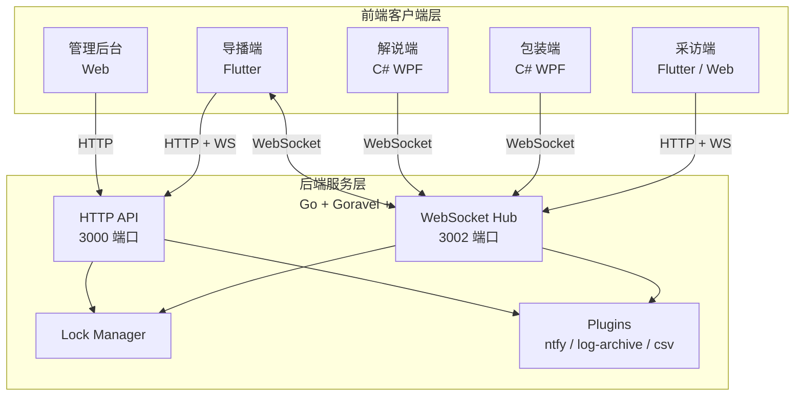
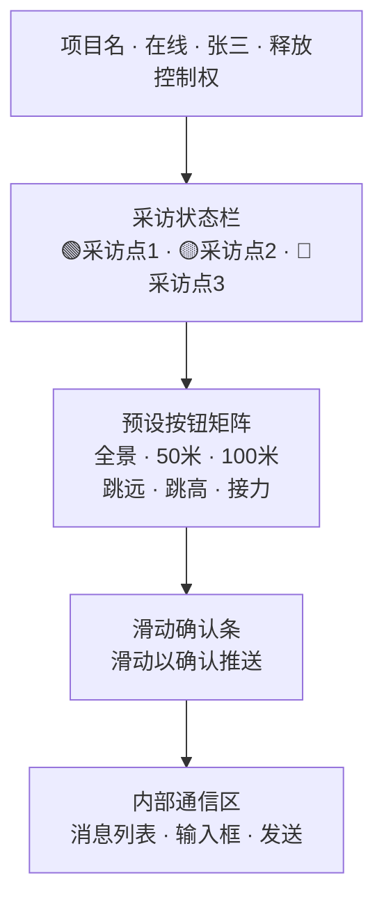
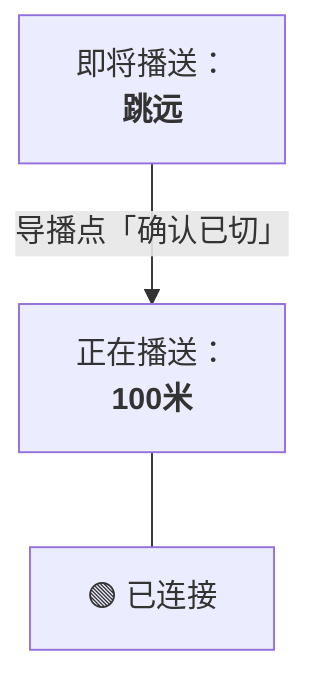
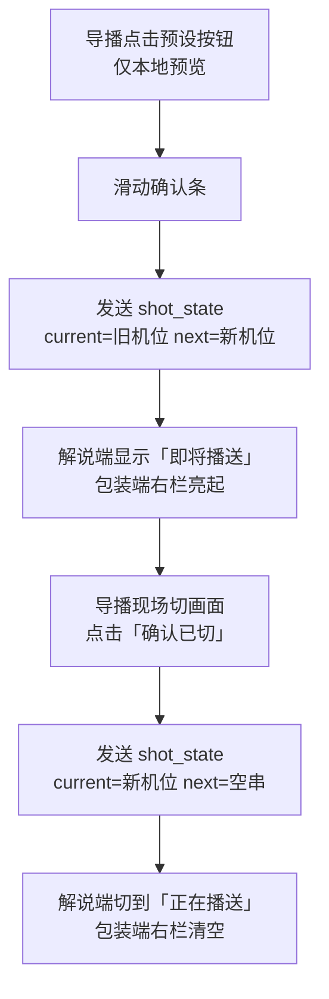

# 校园直播导播协调系统 —— 操作手册

---

## 系统概述

本系统用于校园直播活动中，解决导播切画面与解说不同步的痛点，实现**导播预判指令 → 解说提前准备 → 包装同步联动 → 采访状态透明**的全链路协同。

::: tip 推荐阅读顺序
首次部署建议依次阅读「安装与部署」「配置说明」和「系统初始化」，完成基础配置后再阅读各端操作指南。
:::

### 系统架构


```mermaid
flowchart TD
    subgraph Clients[前端客户端层]
        Admin[管理后台<br/>Web]
        Director[导播端<br/>Flutter]
        Commentator[解说端<br/>C# WPF]
        Packaging[包装端<br/>C# WPF]
        Interviewer[采访端<br/>Flutter / Web]
    end

    subgraph Backend[后端服务层<br/>Go + Goravel + SQLite]
        HTTP[HTTP API<br/>3000 端口]
        WS[WebSocket Hub<br/>3002 端口]
        Lock[Lock Manager]
        Plugins[Plugins<br/>ntfy / log-archive / csv]
    end

    Admin -->|HTTP| HTTP
    Director -->|HTTP + WS| HTTP
    Director <--> |WebSocket| WS
    Commentator -->|WebSocket| WS
    Packaging -->|WebSocket| WS
    Interviewer -->|HTTP + WS| WS
    HTTP --> Lock
    HTTP --> Plugins
    WS --> Lock
    WS --> Plugins
```

### 端口分配

| 端口 | 服务 | 说明 |
|------|------|------|
| 3000 | HTTP API | 管理后台、REST API、认证 |
| 3002 | WebSocket | 实时通讯、采访端 Web 托管 |

### 访问地址

| 页面 | 地址 |
|------|------|
| 系统首页 | `http://<服务器IP>:3000/` |
| 管理后台 | `http://<服务器IP>:3000/admin` |
| 采访端 Web | `http://<服务器IP>:3002/interviewer/` |
| API 状态 | `http://<服务器IP>:3000/api/status` |

---

## 安装与部署

### 环境要求

- **后端**：Go 1.25+、SQLite（内嵌，无需安装）
- **导播端**：Flutter SDK、Android SDK / Windows SDK
- **解说端/包装端**：.NET 10 Runtime
- **采访端**：Flutter SDK（Web 部署）或现代浏览器（Web 访问）

### 后端部署

#### 方式一：直接运行（推荐开发环境）

```bash
cd backend

# 1. 安装依赖
go mod tidy

# 2. 构建并运行
go build -o smart-mzcmc.exe .
./smart-mzcmc.exe
```

**不需要手工 `cp .env.example .env`。** 首次启动时后端会自动创建 `.env` 并补齐
`APP_KEY`、`JWT_SECRET`（各 32 位随机串）与 SQLite 配置，然后进入初始化模式，
在浏览器里完成「配置 + 建管理员」即可，详见下面的[系统初始化](#系统初始化)。

想提前改端口、数据库路径之类的配置，也可以先复制模板再启动：

```bash
cp .env.example .env
# 编辑 .env：APP_HOST / APP_PORT / DB_DATABASE / NTFY_* 等
```

#### 方式二：Docker 部署

```bash
cd backend

# 构建镜像
docker build -t smart-mzcmc .

# 运行容器
docker run -d \
  -p 3000:3000 \
  -p 3002:3002 \
  -v $(pwd)/database:/www/database \
  -v $(pwd)/.env:/www/.env \
  --name smart-mzcmc \
  smart-mzcmc
```

#### 方式三：使用 Air 热重载（推荐开发）

```bash
cd backend
air
```

### 导播端编译

```bash
cd director

# 获取依赖
flutter pub get

# Windows 桌面端
flutter build windows

# Android APK
flutter build apk

# Web 版本
flutter build web
```

### 采访端编译

```bash
cd interviewer

# 获取依赖
flutter pub get

# Web 部署（推荐）
flutter build web

# 产物位置：interviewer/build/web/
# 后端启动时按 public/interviewer -> interviewer/build/web 的顺序查找，
# 所以本地构建后直接重启后端即可；若要模拟线上发布包布局，再执行：
cp -r build/web/* ../backend/public/interviewer/
```

### 解说端/包装端编译

```bash
cd CommentatorApp   # 或 PackagingApp

# 获取依赖
dotnet restore

# 编译
dotnet build -c Release

# 发布（单文件）
dotnet publish -c Release -r win-x64 --self-contained
```

---

## 配置说明

### 后端配置文件 `.env`

::: warning 安全提示
`JWT_SECRET` 必须使用随机字符串，并且不要提交 `.env`、数据库文件或真实的 ntfy 配置。生产环境请关闭调试模式并限制管理端访问范围。
:::

```dotenv
# 应用基础配置
APP_NAME=SmartMZCMC
APP_ENV=local
APP_DEBUG=true
APP_PORT=3000
APP_HOST=0.0.0.0

# JWT 认证（必须配置）
JWT_SECRET=your-random-32-char-secret-key-here

# 数据库（默认 SQLite）
DB_CONNECTION=sqlite
DB_DATABASE=database/smart-mzcmc.db

# 插件配置（可选，详见后文）
# ntfy 告警：两项都填才会启用；只填一项会被停用并在后台标出原因
NTFY_SERVER=https://ntfy.sh
NTFY_TOPIC=your-alert-topic
# PLUGIN_NTFY_ENABLED=false   # 配置齐全但仍想关闭时用

# 日志归档
PLUGIN_LOG_ARCHIVE_ENABLED=true
PLUGIN_LOG_RETENTION_DAYS=30
PLUGIN_LOG_CHECK_INTERVAL=1h

# 采访端掉线扫描（与上面的清理共用一个后台 goroutine）
PLUGIN_PRESENCE_SCAN_INTERVAL=60s
PLUGIN_PRESENCE_TIMEOUT=90s

# 日志导出接口
PLUGIN_CSV_EXPORT_ENABLED=true

# 项目授权校验。默认 false —— 打开前请先把各端的登录账号配好
REQUIRE_PROJECT_MEMBERSHIP=false

# 谁能登录管理后台网页。默认 leader，只有负责人及以上能进后台
ADMIN_MIN_ROLE=leader
```

改完 `.env` 重启后端，然后到管理后台「插件与统计」页确认：
每个插件卡片会显示**真实的启用状态**（已启用 / 已停用）、停用原因和生效配置。
ntfy topic 之类的机密值在界面上是脱敏显示的（形如 `su****yz`）。

若某个插件显示「已停用」，卡片上会直接写明原因，不用去翻服务端日志。

| 环境变量 | 默认值 | 说明 |
|--------|--------|------|
| `NTFY_SERVER` | 空 | ntfy 服务器地址 |
| `NTFY_TOPIC` | 空 | ntfy 主题名 |
| `PLUGIN_NTFY_ENABLED` | 空 | 显式开关；留空按前两项是否配齐自动判断 |
| `PLUGIN_LOG_ARCHIVE_ENABLED` | `true` | 是否启用日志自动清理 |
| `PLUGIN_LOG_RETENTION_DAYS` | `30` | 日志保留天数。同时决定 `storage/exports` 里导出文件的清理期限 |
| `PLUGIN_LOG_CHECK_INTERVAL` | `1h` | 清理检查间隔，支持 `30s` / `5m` / `1h` |
| `PLUGIN_PRESENCE_SCAN_INTERVAL` | `60s` | 采访端掉线扫描间隔 |
| `PLUGIN_PRESENCE_TIMEOUT` | `90s` | 超过这个时长没收到任何消息就判定采访端离线 |
| `PLUGIN_CSV_EXPORT_ENABLED` | `true` | 是否启用日志导出接口 |
| `REQUIRE_PROJECT_MEMBERSHIP` | `false` | 是否强制校验项目成员身份，详见下方「项目授权校验」 |
| `ADMIN_MIN_ROLE` | `leader` | 谁能登录管理后台网页，取角色名，详见下方「角色与权限准入」 |

::: tip 升级到 1.4.0 时先别开 `REQUIRE_PROJECT_MEMBERSHIP`
它默认关闭，关闭时后端只把「本来会被拦下的请求」写进日志。**先把账号配下去、
确认现场都能连上，再打开它。** 详见下方「项目授权校验」一节。
:::

### 项目授权校验

`user_projects` 表记录「谁可以访问哪个项目」。它现在**参与鉴权**：下面是哪些地方会查它。

> 1.4.0 之前这张表只被管理后台增删查，从未决定过任何人能看什么——后勤账号能看到
> 全部项目，控制权接口只从 URL 取项目编号，WebSocket 只要知道 `project_id` 就能
> 监听整个项目的实时消息。开关就是为了补这一层。

`REQUIRE_PROJECT_MEMBERSHIP=true` 之后，以下位置都会校验调用者是不是该项目的
成员（管理员及以上仍然绕过，因为他们本来就要管理所有项目）：

| 位置 | 说明 |
| :--- | :--- |
| `/api/locks/*` | 控制权获取、释放、心跳、查询 |
| `/api/messages/:projectId` | 项目消息 |
| `/api/projects/:projectId/stats` | 项目统计 |
| `/api/projects/:projectId/cameras` | 机位预设 |
| `/api/projects/:projectId/shot-cuts` | 切台记录 |
| WebSocket 握手 | 所有非管理员角色都要带令牌，且必须是该项目成员 |

**打开前的准备顺序**（顺序反了现场会当场断连）：

1. 在管理后台给每个使用者建账号，并在「权限分配」页把他们加到对应项目。
2. 把账号和密码填进各端配置：
   - 解说端 / 包装端：exe 同目录 `config.json` 的 `Username` / `Password`
   - 采访端：`public/interviewer/config.json` 的 `username` / `password`
   - 导播端：本来就要登录，无需额外配置
3. 各端重启（采访端刷新浏览器），确认都能正常连接。
4. 把 `.env` 里的 `REQUIRE_PROJECT_MEMBERSHIP` 改成 `true`，重启后端。

关闭状态下，未授权的访问会写一条这样的日志，可用来先看名单：

```text
[Authz] 用户 zhangsan(#7, logistics) 访问了未授权的项目 3（REQUIRE_PROJECT_MEMBERSHIP=false，仅记录，未拦截）
```

::: warning 凭据留空 = 不登录
三个客户端在账号留空时不会尝试登录，行为与打开开关之前完全一致。
所以可以先把配置发下去、确认没人受影响，再打开后端的开关。
:::

### 角色与权限准入

1.6.0 起，「谁能调这个接口」的判据不再是「谁的等级够高」，而是一张**具名权限对照表**。
这一改动在现场的表现是：某个人被 403 了，后端返回的提示里会直接写出**缺哪一项权限、
这项权限是干什么的、哪些角色能执行**，不用再猜。

::: tip 两层判断，不要混为一谈
| 问题 | 看什么 |
| :--- | :--- |
| 能不能进某个接口 | 具名权限（见下面的对照表） |
| 能不能操作**某个人** | 角色等级（改角色 / 删账号时要求管理员及以上，且不能动同级或更高、不能自降权） |

同一个请求两层都过才放行。等级仍然保留，但它不再决定接口准入——因为等级只能表达
「一条直线」，表达不了「负责人能看、不能改」和「导播能抢锁、负责人不能」。
:::

#### 八个角色

| 角色名（填 `role` 用的值） | 中文名 | 等级 | 定位 |
| :--- | :--- | :-: | :--- |
| `super_admin` | 超级管理员 | 60 | 独占系统在线更新、系统信息与运行指标 |
| `admin` | 管理员 | 50 | 用户、项目、权限分配、日志导出与清理 |
| `leader` | 负责人 | 40 | 排班与调度、授权项目成员、管理采访点、导出数据。**不参与导播工作** |
| `director` | 导播 | 30 | 操作被分配项目的切台与上报 |
| `packaging` | 包装 | 25 | 包装端客户端的登录身份，只订阅与展示 |
| `commentator` | 解说 | 20 | 解说端客户端的登录身份，只订阅与展示 |
| `pre_production` | 前期 | 20 | 素材与采访点准备 |
| `logistics` | 后勤 | 10 | 设备与场地协调，只读为主 |

::: info 解说与前期同为 20 级是故意的
两者都只消费现场产生的数据，权限面完全一样，所以给了同一个等级。等级相同时
「等级 ≥ 门槛」对两者一视同仁，谁当门槛都无所谓。
:::

等级之所以留着不删，是因为判断「能不能操作某个人」确实需要一条高低线：管理员不能
删掉同级同事，更不能删掉超管。

#### 十二项权限

`✓` 表示该角色持有这一项权限。

| 权限名 | 含义 | 超级管理员 | 管理员 | 负责人 | 导播 | 包装 | 解说 | 前期 | 后勤 |
| :--- | :--- | :-: | :-: | :-: | :-: | :-: | :-: | :-: | :-: |
| `log.view` | 看协调日志 | ✓ | ✓ | ✓ | ✓ | ✓ | ✓ | ✓ | ✓ |
| `project.view` | 看项目、机位、切台记录、统计 | ✓ | ✓ | ✓ | ✓ | ✓ | ✓ | ✓ | ✓ |
| `user.view` | 看用户列表 | ✓ | ✓ | ✓ | · | · | · | · | · |
| `audit.view` | 看操作审计 | ✓ | ✓ | · | · | · | · | · | · |
| `log.export` | 导出协调日志 | ✓ | ✓ | ✓ | · | · | · | · | · |
| `interview.manage` | 管理采访点 | ✓ | ✓ | ✓ | · | · | · | ✓ | · |
| `project.member` | 授权 / 回收项目成员 | ✓ | ✓ | ✓ | · | · | · | · | · |
| `switch.operate` | 操作切台 | ✓ | ✓ | · | ✓ | · | · | · | · |
| `log.cleanup` | 清理协调日志 | ✓ | ✓ | · | · | · | · | · | · |
| `project.manage` | 建 / 改 / 删项目、机位预设 | ✓ | ✓ | · | · | · | · | · | · |
| `user.manage` | 增删账号、调整角色 | ✓ | ✓ | · | · | · | · | · | · |
| `system.maintain` | 系统信息、运行指标、在线更新 | ✓ | · | · | · | · | · | · | · |

`switch.operate` 是唯一一个**不连续**的组合：导播（30）有，负责人（40）没有。
这不是配错，而是业务要求——负责人管排期但不参与现场操作。这正是等级制表达不了的
形状，也是本次换掉「比等级」的原因。

`interview.manage` 目前**没有任何接口挂它**：后端还没有采访点的增删改接口。策略里
先声明这一项，是为了让将来接口出来时权限已经存在、且必须被显式挂上——所以今天
不要以为「负责人已经能管采访点了」，实际上没有可调用的入口。

`user.view` 与 `user.manage` 是两行：负责人能看见用户列表（否则他授权成员时连被授权
的人是谁都看不到），但不能增删账号或改角色。

#### 权限挂在哪些接口上

| 权限 | 覆盖的接口 |
| :--- | :--- |
| `log.view` | `GET /api/logs` |
| `log.export` | `POST /api/logs/export`、`POST /api/logs/export/csv` |
| `log.cleanup` | `POST /api/logs/cleanup` |
| `user.view` | `GET /api/admin/users` |
| `user.manage` | `DELETE /api/admin/users/:id`、`PUT /api/admin/users/:id/role`、`POST /api/auth/register`（常态分支） |
| `project.manage` | `GET /api/admin/projects`、`POST /api/admin/projects`、`PUT`/`DELETE /api/admin/projects/:id`、机位预设的增删改 |
| `project.member` | `POST /api/admin/assign`、`POST /api/admin/revoke`、`GET /api/admin/users/:id/projects` |
| `audit.view` | `GET /api/admin/audit-logs` |
| `switch.operate` | `POST /api/locks/:projectId/acquire`、`/release`、`/heartbeat` |
| `system.maintain` | `GET /api/system/info`、`/metrics`、`/update`、`/update/progress`、`POST /api/system/update/apply` |
| `project.view` | 暂未挂任何接口 |
| `interview.manage` | 暂未挂任何接口（后端还没有采访点增删改接口） |

两处需要特别记住：

- **`GET /api/locks/:projectId/status`（锁状态查询）不挂 `switch.operate`。** 谁在控制
  是所有人都关心的事，只有会改变切台状态的三个接口才需要这项权限。
- **`GET /api/admin/projects` 不挂 `project.view`，挂的是 `project.manage`。** 它
  完全不过滤、返回全量项目详情，与按 `user_projects` 过滤的 `GET /api/projects` 是
  两回事。

#### 403 提示怎么读

后端返回的错误信息会把四个信息一次给全，直接照着这句话去找人：

```text
权限不足：缺少权限 project.member（授权/回收项目成员；仅 负责人、管理员、超级管理员 可执行），当前角色为 导播
```

「缺哪一项权限」+「这项权限干什么」+「谁能做」+「你现在是什么角色」。
每次被拒都会同时在服务端的 `[Authz]` 日志里留一条记录。

#### 受保护的部分：改不动的那几格

`system.maintain` 与 `super_admin` 本身是**受保护**的：不可撤销，且只能授予超级管理员。

理由是「一旦丢了就回不来」：在线更新会替换服务自身的可执行文件并重启进程，
任何一次误操作都会影响全系统所有客户端；而一旦没有任何角色持有 `system.maintain`，
现场**没有任何界面能把它恢复回来**，只能登录服务器手改配置文件。`super_admin` 同理——
它是上一条规则唯一的受益者，没有它，那条规则成立却没人满足。

::: warning 改权限要改文件并重启，没有在线编辑
权限对照表写在后端的 `app/rbac/policy.csv` 里，启动时随程序一起加载。管理后台
**没有**「勾选权限」这类界面，所以：

- 调整某个角色的权限 → 改 `policy.csv` → **重启后端**才生效；
- 启动日志会打印「策略已加载：12 项权限 / N 条授权规则」，并核对受保护规则是否
  被破坏。若策略写坏了，系统会**拒绝所有具名权限**（宁可当场不可用，也不能在没有
  策略的情况下放行）。

在线编辑能力不存在，所以上面那两条守卫（不可撤销、只授予超管）现在还没有写入
路径会用到；它们的存在是为了将来开这个功能时不用从零想起这件事。
:::

#### 谁能登录管理后台网页

管理后台网页走的是专用登录入口 `/api/auth/admin-login`，它比 `/api/auth/login`
多一道**等级门槛**，由环境变量 `ADMIN_MIN_ROLE` 控制，默认 `leader`——也就是
**只有负责人及以上能登录网页后台**。导播、包装、解说、前期、后勤会被这道门挡住，
页面提示需要「负责人及以上」。

原生客户端（导播端、解说端、包装端、采访端）走的是 `/api/auth/login`，**不受**
这一项限制，导播账号照常能登录它自己的原生界面。

要放开某几档就改 `.env` 里的 `ADMIN_MIN_ROLE`，可填 `super_admin`、`admin`、
`leader`、`director`、`packaging`、`commentator`、`pre_production`、`logistics`
其中之一，语义是「等级 ≥ 该角色」。填了非法角色名时后端退回 `leader` 并在日志里记一笔。

### 各端地址配置

正式环境走反向代理，所有客户端只需填**一个域名**，不用再带端口：

| 端 | 配置文件 | 是否需要重新编译 |
| :--- | :--- | :--- |
| 管理后台 | 无需配置（默认同源） | 否 |
| 解说端 | exe 同目录 `config.json` | **否**，改完重启 exe |
| 包装端 | exe 同目录 `config.json` | **否**，改完重启 exe |
| 采访端 | `public/interviewer/config.json` | **否**，刷新浏览器 |
| 导播端 | `director/lib/config.dart` | **是**，改完 `flutter build` |

#### 解说端 / 包装端

编辑与 exe 同目录的 `config.json`：

```json
{
  "ServerUrl": "http://zhdb.647382.xyz",
  "WsUrl": "ws://zhdb.647382.xyz/ws",
  "ProjectId": 1,
  "Role": "commentator",
  "Username": "",
  "Password": ""
}
```

> **Role 可选值**：`commentator`（解说端）、`packaging`（包装端）
>
> `ServerUrl` 用于登录（`POST /api/auth/login`），**必须填对**；
> `WsUrl` 用于实时通信。两者指向同一台服务，只是一个走 HTTP、一个走 WebSocket。

| 字段 | 说明 |
| :--- | :--- |
| `ServerUrl` | HTTP 接口地址，登录时用 |
| `WsUrl` | WebSocket 地址，`ws://` 或 `wss://` |
| `ProjectId` | 订阅的项目 ID |
| `Role` | `commentator` / `packaging` |
| `Username` / `Password` | 登录账号。留空表示不登录，适用于未开启项目授权校验的部署 |

登录失败时窗口右下角会显示 `[系统] 登录失败 HTTP 401：...`，而不是一直停在
「连接中...」——现场能直接看出是账号问题还是网络问题。

#### 采访端

编辑 `backend/public/interviewer/config.json`，刷新浏览器即可：

```json
{
  "wsUrl": "ws://zhdb.647382.xyz/ws",
  "projectId": 1,
  "pointCode": "point_1",
  "pointName": "采访点 1",
  "username": "",
  "password": ""
}
```

这是**运行期**配置：采访端是 Web 产物，浏览器启动时会读这个文件覆盖内置默认值。
好处是现场换服务器地址、改账号都不用重新构建、重新部署整个采访端。

`pointCode` 决定这台设备在管理后台里对应哪个采访点。同一项目下多台设备各配一个不同的 `pointCode`。
`config.json` 写坏了也不会让采访端起不来——取不到或字段不合法时会回落到内置默认值。

HTTP 接口地址由 `wsUrl` 推导（`ws://host:3002/ws` → `http://host:3002`），
不需要另配一项。

### 采访端掉线判定

采访端状态有四种，其中「离线」由后端自动产生，不需要现场手动操作：

| 触发条件 | 说明 |
| :--- | :--- |
| WebSocket 断开 | 立即判定，右侧导播端一行变红 |
| 页面切到后台 | 浏览器标签页被切走或锁屏时主动上报 |
| 长时间无消息 | 超过 `PLUGIN_PRESENCE_TIMEOUT`（默认 90 秒）没有任何消息 |

第二条和第三条是必须的：记者走出 WiFi 覆盖范围时，TCP 要等很久才会报错，
连接在服务端看起来仍然「正常」。没有这两条，导播端会一直显示绿色「就绪」，
而人其实早就离开了——屏幕上那个绿色是假的。

掉线会同时触发一条 `interview_offline` 事件，如果配了 ntfy 就会推到管理员手机。

#### 导播端

编辑 `director/lib/config.dart` 后**必须重新编译**：

```dart
class AppConfig {
  static const String serverUrl = 'http://zhdb.647382.xyz';
  static const String wsUrl = 'ws://zhdb.647382.xyz/ws';
}
```

```sh
cd director && flutter build windows --release
```

导播端是装在导播室机器上的原生应用，不像采访端那样有可改的外部配置文件。

---

::: danger 启用 HTTPS 后必须把所有 ws:// 换成 wss://
浏览器把 https 页面里的 `ws://` 判为**混合内容**直接拦掉，
连不上而且**不报任何错**——表现就是各端状态灯一直转圈。

需要改的三处：
1. 解说端 / 包装端的 `config.json`
2. `public/interviewer/config.json`
3. `director/lib/config.dart`（并重新编译）

`serverUrl` 同理要改成 `https://`。
:::

### 反向代理部署

后端本身监听两个端口：`3000`（API、首页、后台、文档站）和 `3002`（WebSocket、采访端）。
生产环境在前面放一层 nginx，把两者收拢到同一个域名：

```nginx
# 必须在 http {} 块里（宝塔的 vhost 文件就是在 http 块内 include 的）
map $http_upgrade $smartmzcmc_connection_upgrade {
    default upgrade;
    ''      close;
}

server {
    # 3002：WebSocket
    location ^~ /ws {
        proxy_pass http://127.0.0.1:3002;
        proxy_http_version 1.1;
        proxy_set_header Upgrade    $http_upgrade;
        proxy_set_header Connection $smartmzcmc_connection_upgrade;
        proxy_set_header Host              $host;
        proxy_set_header X-Forwarded-For   $proxy_add_x_forwarded_for;
        proxy_set_header X-Forwarded-Proto $scheme;
        proxy_read_timeout 300s;
        proxy_buffering off;
    }

    # 3002：采访端
    location ^~ /interviewer/ {
        proxy_pass http://127.0.0.1:3002;
        proxy_set_header Host $host;
    }

    # 3000：其余全部
    location / {
        proxy_pass http://127.0.0.1:3000;
        proxy_set_header Host              $host;
        proxy_set_header X-Forwarded-For   $proxy_add_x_forwarded_for;
        proxy_set_header X-Forwarded-Proto $scheme;
    }
}
```

几个必须注意的点：

| 事项 | 原因 |
| :--- | :--- |
| 用 `location ^~ /ws` 而不是 `= /ws` | 首页还会请求 `/ws/status` 拿在线连接数 |
| **不能**写成 `/ws/` | 后端 Go `ServeMux` 把 `/ws` 注册为精确匹配，带斜杠匹配不上 |
| `proxy_read_timeout` 至少 300s | 默认 60s。笔记本休眠时心跳会停，60s 断线会让服务端释放导播控制权 |
| `Connection` 用 map 而不是写死 `"upgrade"` | 写死会让普通 GET 也带 `Connection: upgrade`，破坏上游 keepalive |
| 删掉宝塔的 `rewrite/go_*.conf` | 那是 Go 框架伪静态模板，会重写查询串，而本项目全靠查询串传参 |
| 3002 只监听 127.0.0.1 | 无需对外开放，公网只暴露 80/443 |

验证：

```bash
curl -I http://zhdb.647382.xyz/                            # 200
curl    http://zhdb.647382.xyz/ws/status                   # {"status":"ok",...}
curl -I http://zhdb.647382.xyz/interviewer/                # 200
curl -I http://zhdb.647382.xyz/interviewer/config.json     # 200
```

`curl` 测不出 WebSocket（不发 Upgrade 头），直接看系统首页右上角的连接状态最快。

---

## 系统初始化

### 初始化向导（推荐）

系统没有预置账号。全新部署时（数据库文件不存在）后端会**自动进入初始化模式**：

| 行为 | 说明 |
| :--- | :--- |
| 自动补 `.env` | 生成 32 位随机 `APP_KEY` / `JWT_SECRET`，并写入 `DB_CONNECTION=sqlite`、`DB_DATABASE` |
| 拦截业务接口 | 除 `/api/setup/*` 与 `/api/health` 外，所有 API 返回 503 `{"code":"setup_required"}` |
| 首页跳转 | 访问 `/` 直接 302 到 `/admin/setup`，管理后台任何页面也会被前端送到向导页 |

打开向导页：

```
http://127.0.0.1:3000/admin/setup
# 局域网部署换成 http://<服务器IP>:3000/admin/setup
```

页面上要填两类信息：

**系统信息**（写进 `.env`）

| 字段 | 对应键 | 说明 |
| :--- | :--- | :--- |
| 系统名称 | `APP_NAME` | 界面上展示的名称，留空用默认值 |
| 对外访问地址 | `APP_URL` | 各端填服务器地址时照抄这个。局域网填 `http://<内网IP>:3000`，反代填域名 |
| 监听地址 | `APP_HOST` | `0.0.0.0` = 局域网内所有机器可访问（推荐）；`127.0.0.1` = 仅本机 |
| 监听端口 | `APP_PORT` | 默认 `3000` |

**管理员账号**：用户名（≤64 字符，字母数字与 `_` `.` `-` 及中文）、显示名、邮箱（可选，仅用于取头像）、密码（**至少 6 位**）。

点击「完成初始化」后，后端会依次：写 `.env` → 执行全部数据库迁移 → 创建账号（固定为
**超级管理员**）。成功后页面会列出写入了哪些键、WebSocket 地址，以及是否需要重启。

::: warning 改了监听地址或端口要重启后端
`.env` 是在进程启动时读入的，监听端口无法热切换。向导页会检测到变化并提示重启；
不重启也不影响本次使用（当前进程仍按旧地址监听），但重启后才生效。
:::

::: danger 初始化完成前不要暴露端口
`POST /api/setup/apply` 与 `POST /api/auth/register` 在系统还没有任何账号时都是公开的。
请先把服务跑起来、立刻完成初始化，再对外开放。
:::

### 手工初始化（无浏览器场景）

初始化模式只在「数据库文件不存在」时才成立，所以也可以完全手工建库，后端就不会拦截：

```bash
cd backend
cp .env.example .env      # 手工填好 JWT_SECRET（APP_KEY 不填也会自动生成）
go run .                  # 建表在启动时自动完成，随后直接 curl 注册管理员
```

> 迁移现在每次启动都会自动跑一遍，所以 `go run . migrate` 不是必需的。
> 它保留下来是为了排障时能单独确认迁移状态，且可以在服务运行时安全执行。

```bash
curl -X POST http://localhost:3000/api/auth/register \
  -H "Content-Type: application/json" \
  -d '{
    "username": "admin",
    "password": "admin123456",
    "display_name": "系统管理员"
  }'
```

成功返回 `201`：

```json
{"id":1,"username":"admin","display_name":"系统管理员","role":"super_admin"}
```

几个要点：

| 事项 | 说明 |
| :--- | :--- |
| `role` 不用传 | 引导模式下该字段会被忽略，第一个账号固定是 `super_admin` |
| 密码至少 6 位 | 低于 6 位返回 400 `密码至少 6 位` |
| 用户名限 64 字符内 | 只能包含字母、数字、`_`、`.`、`-` 与中文 |
| **只有一次机会** | 第一个账号建好后，该接口立刻切换为「仅持有 `user.manage` 的账号可调用」，也就是管理员与超级管理员 |

### 初始化模式相关接口

| 接口 | 说明 |
| :--- | :--- |
| `GET /api/setup/status` | 公开。返回 `needs_setup`、`.env` 路径与可写性、数据库路径、当前默认值、探测到的内网 IP |
| `POST /api/setup/apply` | 公开，但系统已初始化后返回 403。写 `.env`、跑迁移、建首个超级管理员 |

改了数据库路径、想重新初始化时：停服 → 备份并删除 `backend/database/smart-mzcmc.db` → 重启，
后端会重新进入初始化模式。

手工流程的上机验证（确认接口已经收紧）：

```bash
curl http://localhost:3000/api/auth/bootstrap
# 期望 {"needs_bootstrap":false}

curl -X POST http://localhost:3000/api/auth/register \
  -H "Content-Type: application/json" \
  -d '{"username":"test","password":"test123456","role":"admin"}'
# 期望：401 {"error":"系统已有账号，创建用户需要管理员登录"}
```

### 登录管理后台

1. 访问 `http://<服务器IP>:3000/admin`
2. 输入刚创建的用户名与密码
3. 登录成功后进入管理后台

令牌有效期 60 分钟，过期后前端会自动跳回登录页（后端返回 401 + 可读错误消息）。

::: warning 网页后台有独立的登录门槛
网页后台走的是专用登录入口 `/api/auth/admin-login`，比普通登录多一道等级门槛，
由 `.env` 里的 `ADMIN_MIN_ROLE` 控制，默认 `leader`——**只有负责人及以上能登录
网页后台**。导播、包装、解说、前期、后勤的账号在网页后台会登录失败，提示需要
「负责人及以上」。

这不是权限不够，而是这个账号本来就不该进后台：他们的工作在各自的原生客户端上。
导播账号请在导播端登录，解说/包装账号在各自的桌面端登录。需要放开时改
`ADMIN_MIN_ROLE` 并重启后端，详见「角色与权限准入」。
:::

### 创建项目

1. 在管理后台点击「项目管理」标签
2. 点击「+ 新建项目」
3. 填写项目名称（如：校园运动会）、编码（如：sports2025）、描述
4. 点击「创建」

### 创建导播账号

1. 在管理后台点击「用户管理」标签
2. 点击「+ 新建用户」
3. 填写用户名（≤64 字符）、密码（**至少 6 位**）、显示名
4. 角色选择「导播」
5. 点击「创建」

::: tip 创建用户需要 `user.manage` 权限
`新建用户` 走的是同一个 `POST /api/auth/register`，但在系统已有账号之后，它要求
调用者持有 `user.manage` 权限——也就是管理员或超级管理员。负责人虽然能看用户列表
、能授权项目成员，但**不能建号**；导播账号自己调这个接口会收到 403。
:::

### 分配项目权限

1. 在管理后台点击「权限分配」标签
2. 选择用户和项目
3. 点击「分配」

---

## 各端操作指南

### 导播端（Flutter 手机/平板）

#### 登录

1. 启动导播端应用
2. 输入服务器地址、用户名、密码
3. 点击「登录」

#### 主界面说明


```mermaid
flowchart TB
    Header[项目名 · 在线 · 张三 · 释放控制权]
    Status[采访状态栏<br/>🟢采访点1 · 🟡采访点2 · 🔵采访点3]
    Presets[预设按钮矩阵<br/>全景 · 50米 · 100米<br/>跳远 · 跳高 · 接力]
    Confirm[滑动确认条<br/>滑动以确认推送]
    Chat[内部通信区<br/>消息列表 · 输入框 · 发送]

    Header --> Status --> Presets --> Confirm --> Chat
```

#### 操作流程

1. **获取控制权**：点击右上角「获取控制权」按钮
2. **选择项目**：从下拉框选择当前直播项目
3. **发送切台指令**（每次切台分两步，后端各收到一条 `shot_state`）：
   - 点击预设按钮（如「50米」），状态条显示「即将切台 50米」
   - **滑动底部确认条** → 下发「即将切台」，解说端变红，包装端右栏亮起
   - 现场把画面切过去后，点击 **「确认已切」** → 下发「正在播送」，
     解说端变绿，包装端右栏清空
4. **发送内部消息**：在底部输入框输入消息，点击「发送」
5. **释放控制权**：点击右上角「释放控制权」按钮

> **注意**：同一项目同一时间只有一名导播能持有控制权。导播断线时控制权自动释放。

### 解说端（C# 桌面应用）

#### 启动

1. 双击 `CommentatorApp.exe`
2. 应用自动读取 `config.json` 配置并连接服务器
3. 右下角绿点表示已连接

#### 界面说明

窗口只有一块主显示区，按后端指令在两种状态间切换：


```mermaid
flowchart TB
    Pending["即将播送：<br/><strong>跳远</strong>"]
    OnAir["正在播送：<br/><strong>100米</strong>"]
    Connection[🟢 已连接]

    Pending -->|导播点「确认已切」| OnAir
    OnAir --- Connection
```

#### 状态说明

| 状态 | 显示 |
|------|------|
| 收到 `shot_state`，`next` 非空 | 「即将播送：」+ 机位名，**琥珀红**，背景转为暗红 |
| 收到 `shot_state`，`next` 为空 | 「正在播送：」+ 机位名，**绿色**，背景为深蓝 |
| 收到新的 `shot_state` | 整体替换为新状态，不需要等待 |
| 断线重连 | 右下角红点，自动重连（指数退避） |

> 解说端不再自行推断「正在播送」，也不再有 5 秒自动清空计时器——
> 状态完全由后端下发的 `shot_state` 决定。

### 包装端（C# 桌面应用）

#### 启动

1. 双击 `PackagingApp.exe`
2. 应用自动读取 `config.json` 配置并连接服务器

#### 功能

- 同时显示「正在播送」与「即将切台」两栏，由后端 `shot_state` 驱动
- 接收导播发送的内部消息
- 显示消息历史记录

### 采访端（Flutter/Web）

#### 方式一：Web 访问（推荐）

1. 浏览器访问 `http://<服务器IP>:3002/interviewer/`
2. 页面显示巨大状态按钮

#### 方式二：Flutter App

1. 启动应用，修改 `config.dart` 中的服务器地址和采访点配置
2. 编译运行

#### 操作

- **点击巨大按钮**切换状态：
  - 灰色（未就绪）→ 蓝色（准备中）→ 绿色（就绪）→ 循环
- 状态变更实时推送给导播端和包装端
- 底部显示 WebSocket 连接状态

---

## API 接口参考

### 认证接口

| 方法 | 路径 | 说明 | 认证 |
|------|------|------|------|
| POST | `/api/auth/login` | 登录（原生客户端走这个） | 否 |
| POST | `/api/auth/admin-login` | 登录管理后台网页，额外要求角色达到 `ADMIN_MIN_ROLE` | 否 |
| POST | `/api/auth/register` | 创建用户（见下方双模式说明） | 视状态而定 |
| GET | `/api/auth/bootstrap` | 是否仍未初始化（`{"needs_bootstrap":false}` 表示已有人） | 否 |
| GET | `/api/auth/profile` | 获取当前用户信息 | JWT |
| PUT | `/api/auth/profile` | 修改自己的显示名与邮箱（不挂任何权限） | JWT |
| PUT | `/api/auth/password` | 修改自己的密码，旧令牌立即失效 | JWT |
| GET | `/api/auth/permissions` | 当前账号生效的权限名清单 | JWT |
| GET | `/api/roles` | 角色清单（角色名与中文名） | JWT |

**登录请求示例：**

```json
POST /api/auth/login
{
  "username": "admin",
  "password": "admin123456"
}
```

**登录响应：**

```json
{
  "token": "eyJhbGciOiJIUzI1NiIs...",
  "user": {
    "id": 1,
    "username": "admin",
    "display_name": "系统管理员",
    "role": "admin"
  }
}
```

::: warning `POST /api/auth/register` 的双模式
这是一个**公开路由**（不在 JWT 中间件组里），但它自己承担了模式判断，行为取决于
数据库当前状态：

| 系统状态 | 需要认证 | `role` 字段 | 用途 |
| :--- | :--- | :--- | :--- |
| **用户表为空** | 否 | 被忽略，强制 `super_admin` | 全新部署创建第一个管理员 |
| **已有任何用户** | 是，且必须持有 `user.manage`（管理员 / 超级管理员） | 八个角色之一，且不能高于调用者 | 管理后台「新建用户」 |

常态分支的判据是**权限**而不是角色：只有管理员与超级管理员持有 `user.manage`。
导播、包装、解说、前期、后勤、负责人一律 403——负责人虽然能看用户列表、能授权项目
成员，但不能建号。另外它只校验「不能授予高于自己的角色」，所以调用者自身拿到的权限
仍由 `user.manage` 这道门把关，两条是叠加的。

另外：

- 密码至少 6 位，否则 400；
- 用户名 ≤64 字符，仅限字母、数字、`_`、`.`、`-` 与中文，否则 400；
- 用户名重复返回 409；
- 引导模式下第一个账号固定为 `super_admin` 而不是 `admin`：只有超级管理员能授予
  超管角色，引导出来的是管理员的话系统会停在一个「谁也管不了谁」的状态。

对应状态码：401 未登录/令牌无效、403 权限不足、400 参数不合法、409 用户名已存在。
:::

#### `GET /api/auth/permissions`：当前账号有什么权限

管理后台用它决定**显示哪些入口、哪些按钮**，判据是权限名而不是角色名：

```json
GET /api/auth/permissions
{
  "role": "leader",
  "role_label": "负责人",
  "permissions": ["log.view", "project.view", "user.view", "log.export",
                  "interview.manage", "project.member"]
}
```

几点要注意：

- 门槛是「登录即可」：它只回答「我自己能干什么」，不需要任何管理权限。
- **只返回调用者自己的权限**，不返回全量对照表。所以不要指望它列出「谁有什么」。
- 它返回的是**权限名**，与接口要求的权限名一一对应——看到一个名字就能对上
  「这个人能不能调这条接口」。完整对照见[角色与权限准入](#角色与权限准入)。
- 这份清单与实际准入永远一致：两者读的是同一份策略，不会出现「菜单里没有但地址栏
  能进」或「菜单里有但点了 403」。

### 管理接口（需 JWT + 具名权限）

1.6.0 起这一组接口不再统一要求「admin 角色」，而是**逐组挂不同的具名权限**。
「权限」列就是调用者必须持有的那项权限，持有者见[角色与权限准入](#角色与权限准入)。

| 方法 | 路径 | 所需权限 | 说明 |
|------|------|------|------|
| GET | `/api/admin/users` | `user.view` | 用户列表（负责人及以上） |
| DELETE | `/api/admin/users/:id` | `user.manage` | 删除用户（管理员及以上） |
| PUT | `/api/admin/users/:id/role` | `user.manage` | 更新用户角色（管理员及以上） |
| GET | `/api/admin/projects` | `project.manage` | 项目列表（全部，按日程排序，不过滤） |
| POST | `/api/admin/projects` | `project.manage` | 创建项目 |
| PUT | `/api/admin/projects/:id` | `project.manage` | 更新项目（名称、描述、场地、日程、状态、模式） |
| DELETE | `/api/admin/projects/:id` | `project.manage` | 删除项目 |
| POST | `/api/admin/projects/:id/cameras` | `project.manage` | 新增机位预设 |
| PUT | `/api/admin/projects/:id/cameras/:cameraId` | `project.manage` | 修改机位（改名、调顺序） |
| DELETE | `/api/admin/projects/:id/cameras/:cameraId` | `project.manage` | 删除机位 |
| POST | `/api/admin/assign` | `project.member` | 分配用户到项目（负责人及以上） |
| POST | `/api/admin/revoke` | `project.member` | 撤销项目授权（负责人及以上） |
| GET | `/api/admin/users/:id/projects` | `project.member` | 查询用户项目（负责人及以上） |
| GET | `/api/admin/audit-logs` | `audit.view` | 操作审计记录（管理员及以上） |

`user.view` 与 `user.manage` 分开是 1.6.0 的新增能力：此前这一整组接口共用一道
「管理员」门槛，于是负责人能授权成员、能管采访点，却连被授权的人是谁都看不到。

::: tip 系统接口不在这一组里
`/api/system/*`（系统信息、运行指标、在线更新）挂的是 `system.maintain`，只有超级
管理员持有，且它是受保护权限。详见[角色与权限准入](#角色与权限准入)。
:::

**`PUT /api/admin/projects/:id` 的字段语义是「出现了就更新」**，空串表示清空：

```json
{
  "name": "春季运动会",
  "description": "",
  "venue": "田径场",
  "scheduled_start": "2026-05-20T09:00",
  "scheduled_end": "2026-05-20T18:00",
  "status": "planned",
  "mode": "live"
}
```

上面这个请求会把描述**清空**。不传某个字段则表示「不动它」。

`status` 可选 `planned` / `live` / `finished` / `cancelled`，
`mode` 可选 `live`（正式直播）/ `rehearsal`（彩排）；彩排与正式的切台记录分开统计。
时间字段接受 `<input type="datetime-local">` 的 `2026-05-20T09:00` 写法（不带秒）。

::: danger 只校验「令牌有效」是不够的
JWT 中间件只判断令牌能不能被解开，不关心持有者是谁。所以这组接口在 JWT 之后还挂了
一道**具名权限**校验（表格里的「所需权限」列）：每次请求都查库拿到当前角色再查权限
对照表，**不信任令牌里缓存的角色**。

这样管理员在后台把某个人的角色降下来，那个人手里的旧令牌会**立即失效**，
而不是等到 60 分钟自然过期。少了这一层，任何登录用户（包括最低权限的导播）
都能列出全部用户与项目、增删项目、分配权限。

**注意不要再按「角色名」理解这一层。** 1.6.0 之前这里挂的是 `RequireRole("admin")`
（等级门槛，语义是 `等级 >= 管理员`），现在 `routes/web.go` 里已经没有一条路由再挂
等级门槛了——每条路由挂的是自己需要的具名权限。等级仍然保留，但它只管「能不能操作
某个人」（改角色、删账号），两件事是分开的。
:::

### 项目接口（需 JWT 认证）

| 方法 | 路径 | 说明 |
|------|------|------|
| GET | `/api/projects` | 当前账号有权访问的项目，按「正在直播 > 即将开始 > 无日程 > 已结束」排序 |
| GET | `/api/projects/:projectId/cameras` | 项目的机位预设，按配置顺序 |
| GET | `/api/projects/:projectId/shot-cuts` | 切台时间线与报表 |
| GET | `/api/projects/:projectId/stats` | 项目统计 |

::: warning 它和管理接口 `/api/admin/projects` 不是一回事
| | `GET /api/projects` | `GET /api/admin/projects` |
| :--- | :--- | :--- |
| 准入 | JWT（+ 成员校验打开时还要成员） | JWT + `project.manage`（管理员及以上） |
| 过滤 | **按 `user_projects` 收窄**，非管理员只拿授权给他的 | **完全不过滤**，返回全量项目详情（描述、场馆、排期、负责人） |

正因为后者不过滤，它才挂 `project.manage` 而不是 `project.view`：把它降到「人人可看」
等于开了一个绕过过滤的后门。导播端的项目下拉靠的是左边这条，此前误用了管理接口，
结果导播调它一律 403、下拉框恒为空。
:::

::: info 「有权访问」有一个例外
`GET /api/projects` 对管理员及以上返回全部项目；对其他人，**只要他被授权过至少一个
项目**就只返回被授权的那些。**一个项目都没被授权的人会拿到全部项目**——这是刻意的
兜底，否则刚接上鉴权的存量部署会看到空下拉框，现场直接没法播。
:::

`GET /api/projects/:projectId/shot-cuts` 支持 `from` / `to`（时间范围）、
`shot`（机位）与 `limit`，返回时间线加汇总：

```json
{
  "project_id": 1,
  "total": 12,
  "cuts": [
    { "id": 12, "from_shot": "全景", "to_shot": "跳远", "director_id": 3,
      "mode": "live", "cut_at": "2026-05-20T10:12:33+08:00" }
  ],
  "summary": {
    "cut_count": 12,
    "avg_dwell_seconds": 184.5,
    "by_shot": [{ "shot": "跳远", "count": 3, "avg_dwell_seconds": 95.2 }],
    "by_mode": [{ "mode": "live", "cut_count": 9 }, { "mode": "rehearsal", "cut_count": 3 }]
  }
}
```

只有**真的切过去了**才记一行：导播发预告（`current` 不变）不算，
按「确认已切」让 `current` 变化才算。最后一段没有后续切台，停留多久无从得知，
所以不参与平均——否则这个数字会随着你盯着屏幕的时间不断变大。

### 控制权接口（需 JWT 认证）

| 方法 | 路径 | 所需权限 | 说明 |
|------|------|------|------|
| POST | `/api/locks/:projectId/acquire` | `switch.operate` | 获取控制权 |
| POST | `/api/locks/:projectId/release` | `switch.operate` | 释放控制权 |
| POST | `/api/locks/:projectId/heartbeat` | `switch.operate` | 心跳续期 |
| GET | `/api/locks/:projectId/status` | 登录（+ 成员） | 查询锁状态 |

开启 `REQUIRE_PROJECT_MEMBERSHIP` 后，这组接口会先校验调用者是不是该项目的成员，
否则返回 403。

`switch.operate` 的持有者是**导播、管理员、超级管理员**——注意里面没有负责人。
这是唯一一组不连续的权限：负责人等级（40）比导播（30）高，但按业务不参与现场操作，
所以不能操作切台。管理员及以上保留是为了救场（切台锁卡死、导播端崩了没人接手）。

### 采访接口（无需认证）

| 方法 | 路径 | 说明 |
|------|------|------|
| GET | `/api/interview/:projectId` | 查询项目采访状态 |
| POST | `/api/interview/status` | 更新采访状态 |

`POST /api/interview/status` 接受 `ready` / `preparing` / `not_ready` / `offline`
四种状态。写入后后端会同时广播给导播端与包装端，所以**数据库里的状态和界面上
显示的状态永远一致**——此前这条 HTTP 接口只写库不广播、WebSocket 那条只广播不
写库，两边长期对不上。

采访端掉线（断连 / 页面切后台 / 超时）时后端会自动把它置为 `offline`，
不需要客户端显式调用。但客户端仍会主动 POST 一次，因为这条路径在
WebSocket 已经不可用时还能到达服务端。

### 日志与审计接口（需 JWT 认证）

| 方法 | 路径 | 所需权限 | 说明 |
|------|------|------|------|
| GET | `/api/messages/:projectId` | 登录（+ 成员） | 查询项目消息 |
| GET | `/api/logs` | `log.view`（全员） | 查询协调日志 |
| GET | `/api/admin/audit-logs` | `audit.view`（管理员及以上） | 查询操作审计 |
| POST | `/api/logs/export` | `log.export`（负责人及以上） | 导出日志（JSON），写入 `storage/exports` |
| POST | `/api/logs/export/csv` | `log.export`（负责人及以上） | 导出日志（CSV），写入 `storage/exports` |
| POST | `/api/logs/cleanup` | `log.cleanup`（管理员及以上） | 清理旧日志 |

导出与清理是两项不同的权限：导出能把整个项目历史拉走（或落成文件带出系统），
清理是真的删数据、删的正是审计线索本身。1.6.0 之前这两条共用一道「管理员」门槛，
等于把「只能导不能删」绑在一起，让不需要删除权限的人也被迫持有删除权限。

`GET /api/logs` 支持以下参数：

| 参数 | 说明 |
| :--- | :--- |
| `project_id` | 项目筛选 |
| `type` | 消息类型筛选 |
| `sender_id` | 发件人筛选 |
| `from` / `to` | 时间范围，接受 `2026-05-20` 与 `2026-05-20T09:30` 两种写法 |
| `limit` | 每页条数，默认 100，上限 500 |
| `cursor` | 上一页返回的 `next_cursor`，用于翻页 |

响应里的 `total` 是**匹配筛选条件的真实总行数**，与本页 `messages` 的长度无关。
分页用游标而不是页码：日志表持续写入，用偏移量翻页会重复看到或整段跳过记录。

**导出接口的 `from` / `to` 是必填的**，单次上限 2 万行：

```json
{ "project_id": 1, "from": "2026-05-01", "to": "2026-05-21" }
```

上限触发时响应里的 `truncated` 为 `true`，应缩小时间范围再导一次。
`storage/exports` 里的文件会按 `PLUGIN_LOG_RETENTION_DAYS` 自动清理——
管理后台的「导出 CSV（当前结果）」是在浏览器里拼装的，服务端这份主要是留存。

### 操作审计

管理后台的「日志与审计」页分成两个 Tab，它们是**两回事**：

| Tab | 数据来源 | 内容 |
| :--- | :--- | :--- |
| 协调日志 | `messages` 表 | 谁切了台、谁发了内部消息、采访点状态变化 |
| 操作审计 | `audit_logs` 表 | 谁改了别人的角色、谁删了账号、谁清了日志 |

操作审计覆盖：删除账号、修改角色、修改个人资料、项目增删改、机位增删改、
权限授予与撤销、日志清理、系统在线更新。

::: warning 日志清理本身也会留痕
「清理日志」会真的删数据，被删的历史记录是审计对象。所以清理动作自己也会写
一条 `logs.cleanup` 审计记录，否则「谁把证据清了」永远查不出来。
:::

审计记录里的用户名是**脱敏存储**的（形如 `r***`），需要精确追溯时用
`actor_id` 去用户表查。记录里还带来源 IP。

### WebSocket 连接

::: info 连接提示
导播端和管理员连接必须携带 JWT。解说端、包装端和采访端在
`REQUIRE_PROJECT_MEMBERSHIP=true` 时**也必须携带**——否则会在握手阶段被拒
（分别返回 401 和 403）。连接地址使用 `3002` 端口，不是 HTTP API 的 `3000` 端口。
:::

```
ws://<服务器IP>:3002/ws?project_id=1&role=director&token=<JWT>
```

**连接参数：**

| 参数 | 必填 | 说明 |
|------|------|------|
| project_id | 是 | 项目 ID |
| role | 是 | 角色：`director`（导播）/ `commentator`（解说）/ `packaging`（包装）/ `interviewer`（采访）/ `admin` / `super_admin` |
| token | 见上 | JWT 令牌 |
| user_id | 否 | 用户 ID |
| point_code | 采访端必填 | 采访点编码 |

**连接建立后的第一条消息**（`system` 类型）会带上当前切台状态：

```json
{
  "type": "system",
  "project_id": 1,
  "payload": {
    "message": "连接成功",
    "online_count": 4,
    "current_shot": "100米",
    "next_shot": "",
    "state_available": true
  },
  "timestamp": 1789000000000
}
```

客户端据此**在连上的一瞬间就显示正确的画面状态**。没有这一步，中途连上来的
解说端会一直停在「等待导播指令」，直到下一次切台——而这中间的解说内容已经
和画面脱节了。断线重连同理。`state_available` 为 `false` 表示这个项目还没切过台。

**消息格式：**

```json
{
  "type": "shot_state",
  "project_id": 1,
  "sender_id": 1,
  "payload": { "current": "100米", "next": "跳远" },
  "timestamp": 1789000000000
}
```

---

## 核心机制说明

### 控制权互斥

- 同一项目同一时间只有一名导播持有控制权
- 导播上线时自动获取控制权（如果无人持有）
- 控制权有效期 90 秒，需定期心跳续期（30 秒间隔）
- 导播断线时自动释放控制权
- 锁过期后会由后台扫描清理并广播 `lock_update`，同时发一条 `lock_timeout`
  事件（配了 ntfy 就会推送）。此前锁只在「有人查询时」才会被顺手删掉，
  没人查就永远不删，超时告警从未触发过。

### 状态流转

切台是「预告 → 确认」两步，每一步后端都会收到一条携带完整状态的 `shot_state`。


```mermaid
flowchart TB
    A[导播点击预设按钮<br/>仅本地预览]
    B[滑动确认条]
    C["发送 shot_state<br/>current=旧机位 next=新机位"]
    D[解说端显示「即将播送」<br/>包装端右栏亮起]
    E[导播现场切画面<br/>点击「确认已切」]
    F["发送 shot_state<br/>current=新机位 next=空串"]
    G[解说端切到「正在播送」<br/>包装端右栏清空]

    A --> B --> C --> D --> E --> F --> G
```

接收端不推断状态、不做本地计时，完全按后端下发的 `shot_state` 渲染。
每次通过校验的切台都会往 `shot_cuts` 表写一行，用于赛后复盘。

### 断线重连

- 指数退避重连：1s → 2s → 4s → 最大 10s
- **重连后由欢迎消息补发当前切台状态**，不重放历史消息

> 状态类信息（正在播送哪个机位）只在服务端保留最新一份（`project_states` 表），
> 重连时随欢迎消息下发。聊天记录与切台历史不补发，需要翻看请到管理后台。

### 采访状态

| 状态 | 颜色 | 说明 |
|------|------|------|
| ready | 绿色 | 已就绪 |
| preparing | 蓝色 | 准备中 |
| not_ready | 灰色 | 未就绪 |
| offline | 红色 | 离线（由后端判定，见「采访端掉线判定」） |

---

## 故障排查

::: details 快速诊断顺序
先检查后端进程和 `3000/3002` 端口，再检查客户端服务器地址、项目 ID、角色和 JWT。最后查看后端控制台中的 `[AUTHZ]`、`[AUTH]`、`[WS]` 日志。
:::

### 后端无法启动

| 问题 | 解决方案 |
|------|----------|
| 端口被占用 | 检查 3000/3002 端口：`netstat -ano | findstr :3000` |
| JWT_SECRET 未配置 | 在 `.env` 中设置 `JWT_SECRET` |
| 数据库权限问题 | 确保 `database/` 目录可写 |

### 客户端无法连接

| 问题 | 解决方案 |
|------|----------|
| WebSocket 连接失败 | 检查防火墙是否开放 3002 端口 |
| 认证失败 | 检查 JWT 是否过期，重新登录获取新 token |
| 控制权获取失败 | 检查是否已有其他导播持有控制权 |
| 控制权获取返回「缺少权限 switch.operate」 | 该账号不是导播 / 管理员 / 超级管理员。负责人等级虽高于导播，但按业务不参与导播工作，**不持有**这项权限 |
| 提示「权限不足：缺少权限 xxx」 | 照错误信息里的「哪些角色可执行」去改账号角色，或换用持有者账号。该账号不是项目成员是另一回事，提示文案不同 |
| 提示「无权访问该项目」(403) | 开启了项目授权校验但该账号没被分配到该项目。到管理后台「权限分配」页加上，或临时把 `REQUIRE_PROJECT_MEMBERSHIP` 改回 `false` |
| 提示「该项目需要登录后访问」(401) | 同上，但客户端连账号都没填 |

### 解说端/包装端无法连接

| 问题 | 解决方案 |
|------|----------|
| 启动后无反应 | 检查 `config.json` 中的 `ServerUrl` 与 `WsUrl` |
| 连接后断开 | 检查网络稳定性，应用会自动重连 |
| WebSocket 地址错误 | 确认 `WsUrl` 指向 3002 端口 |
| 界面显示「登录失败 HTTP 401」 | `Username` / `Password` 不对，或该账号已被删除 |
| 界面显示「登录失败 HTTP 403」 | 该账号不是 `ProjectId` 的成员 |

### 日志导出失败

| 问题 | 解决方案 |
|------|----------|
| 提示「必须提供 from 与 to 时间范围」 | 导出接口不再允许对整个项目历史做无条件查询，界面上选好时间范围即可 |
| 导出结果比预期少 | 单次上限 2 万行，缩小时间范围分几次导 |

### 磁盘被导出文件占满

`storage/exports` 下的文件由 `log-archive` 插件按 `PLUGIN_LOG_RETENTION_DAYS`
自动清理。若该插件被停用（`PLUGIN_LOG_ARCHIVE_ENABLED=false`），导出文件不会
被删除，需要手工清理该目录。

### 登录管理后台被拒

| 现象 | 原因与处理 |
|------|----------|
| 网页后台登录失败，提示「需要负责人及以上」 | 账号角色低于 `ADMIN_MIN_ROLE`（默认 `leader`）。这是默认行为，导播/包装/解说/前期/后勤本就不该进后台；要放开就改 `.env` 的 `ADMIN_MIN_ROLE` 并重启 |
| 后端启动日志出现「策略已加载：12 项权限 / N 条授权规则」，随后全部接口 403 | 策略文件加载失败，`app/rbac` 会 fail-closed 拒绝所有具名权限。核对 `policy.csv` 是否被改动过，然后重启 |
| 后端启动日志出现「策略里出现了未知角色 / 未知权限」 | 策略文件里角色名或权限名拼错了。角色名必须与代码里的常量一字不差 |

---

## 快速启动检查清单

- [ ] 后端 `.env` 已配置 `JWT_SECRET`
- [ ] 后端已启动（3000 + 3002 端口）
- [ ] 管理员账号已创建（网页后台默认只有负责人及以上能登录，默认值由 `ADMIN_MIN_ROLE` 控制）
- [ ] 项目已创建（建议填好计划时间，导播端据此把当前/下一场置顶）
- [ ] 导播账号已创建并分配项目权限
- [ ] 导播端已配置服务器地址并登录
- [ ] 解说端/包装端 `config.json` 已配置正确地址（开成员校验时还要填账号）
- [ ] 采访端 `config.dart` 已配置服务器地址和采访点
- [ ] 所有客户端均已连接（检查连接状态指示器）
- [ ] 若要用 `REQUIRE_PROJECT_MEMBERSHIP`：账号已下发、各端都能连上，再打开开关

---

## 附录

### 项目目录结构

```
smart-mzcmc/
├── backend/              # Go 后端（Goravel 框架）
│   ├── app/              # 应用逻辑
│   │   ├── http/         # HTTP 控制器和中间件
│   │   ├── models/       # 数据模型
│   │   ├── plugins/      # 插件系统
│   │   └── ws/           # WebSocket 服务
│   ├── config/           # 配置文件
│   ├── database/         # SQLite 数据库
│   ├── public/           # 静态资源
│   │   ├── admin/        # 管理后台
│   │   └── interviewer/  # 采访端 Web 产物
│   ├── routes/           # 路由定义
│   └── .env              # 环境配置
├── director/             # 导播端 Flutter 项目
├── interviewer/          # 采访端 Flutter 项目
├── CommentatorApp/       # 解说端 C# 项目
├── PackagingApp/         # 包装端 C# 项目
├── plan.md               # 项目开发计划
└── start.bat             # 一键启动脚本（Windows）
```

### WebSocket 消息类型

| 类型 | 方向 | 说明 |
|------|------|------|
| shot_state | 导播 → 解说/包装 | 切台状态：`current` 当前播送 + `next` 即将切台（空串=已切完） |
| chat | 全部 | 内部消息；`{"message":"heartbeat"}` 为保活心跳，后端不落库不转发 |
| interview_status | 采访端 → 导播/包装 | 采访状态变更，后端会先落库再广播 |
| lock_update | 系统 → 全部 | 控制权变更通知，`payload.reason` 可为 `disconnect` 或 `timeout` |
| system | 系统 → 客户端 | 系统消息（连接成功、权限错误等）；连接成功时带上 `current_shot` |

> `next_shot` / `confirm_switch` 是协议升级前的旧类型，后端已合并进 `shot_state`，
> 收到时只回一条 `system` 错误并丢弃。

### 数据表

| 表 | 用途 |
| :--- | :--- |
| `users` | 账号、密码哈希、角色、令牌版本 |
| `projects` | 项目、日程、场地、状态与模式 |
| `user_projects` | 项目授权关系（`REQUIRE_PROJECT_MEMBERSHIP` 的判定依据） |
| `project_locks` | 控制权及过期时间 |
| `project_states` | 项目当前的切台状态，一个项目一行 |
| `shot_cuts` | 切台流水，用于时间线与报表 |
| `project_cameras` | 机位预设 |
| `interview_status` | 各采访点当前状态 |
| `messages` | 协调日志（WebSocket 消息与操作记录） |
| `audit_logs` | 操作审计 |

### 默认配置值

| 配置项 | 默认值 | 说明 |
|--------|--------|------|
| 控制权有效期 | 90 秒 | 导播控制权 TTL |
| 心跳间隔 | 30 秒 | 导播端心跳发送间隔 |
| WebSocket 超时 | 60 秒 | 读写超时 |
| 采访端心跳间隔 | 10 秒 | 采访端客户端心跳发送间隔 |
| 采访端掉线阈值 | 90 秒 | 超过此时长没消息即判定离线 |
| 日志保留 | 30 天 | 自动清理旧日志与导出文件 |
| 导出单次上限 | 20000 行 | 超出时间范围的导出会被截断 |
